# ZaspOps MVP — Architecture and Flow Diagrams

Aligned with **Technical Implementation Plan v2.2 (2026-08-12)**. Section references (§) point at the plan. Regenerate these when the plan changes.

## 1. Overall MVP architecture (§4–§7)

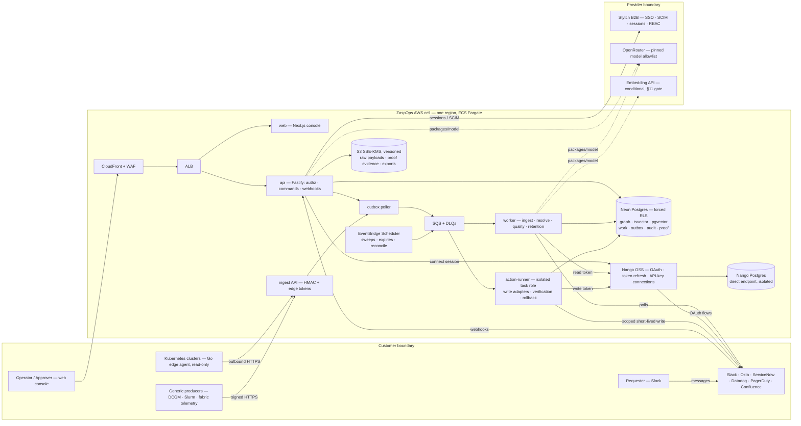

## 2. Milestone and gate map (§21–§22)

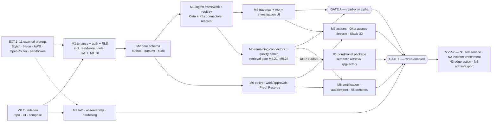

## 3. Flow: infrastructure investigation / blast radius (§12, §14; tasks M4.x)

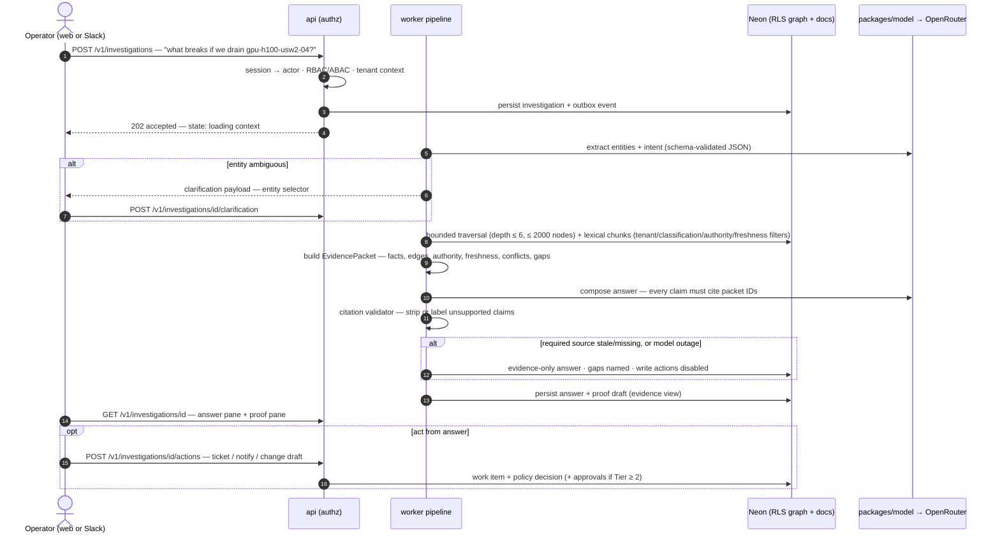

## 4. Flow: Ask / retrieval pipeline with the embedding decision gate (§11)

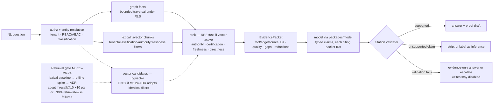

## 5. Flow: time-bound Okta access — request → approve → provision → verify → expire → revoke (§12, §14; tasks M6–M7)

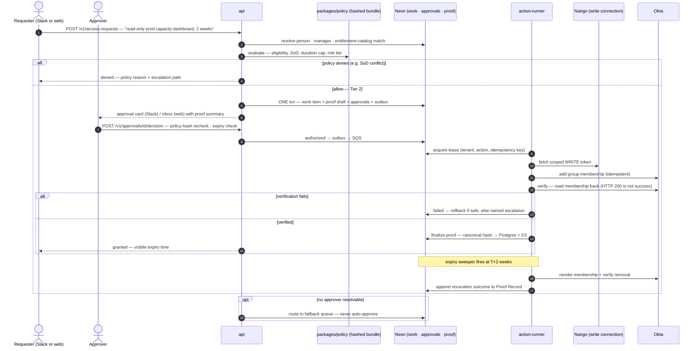

## 6. Governed action lifecycle — state machine (§12)

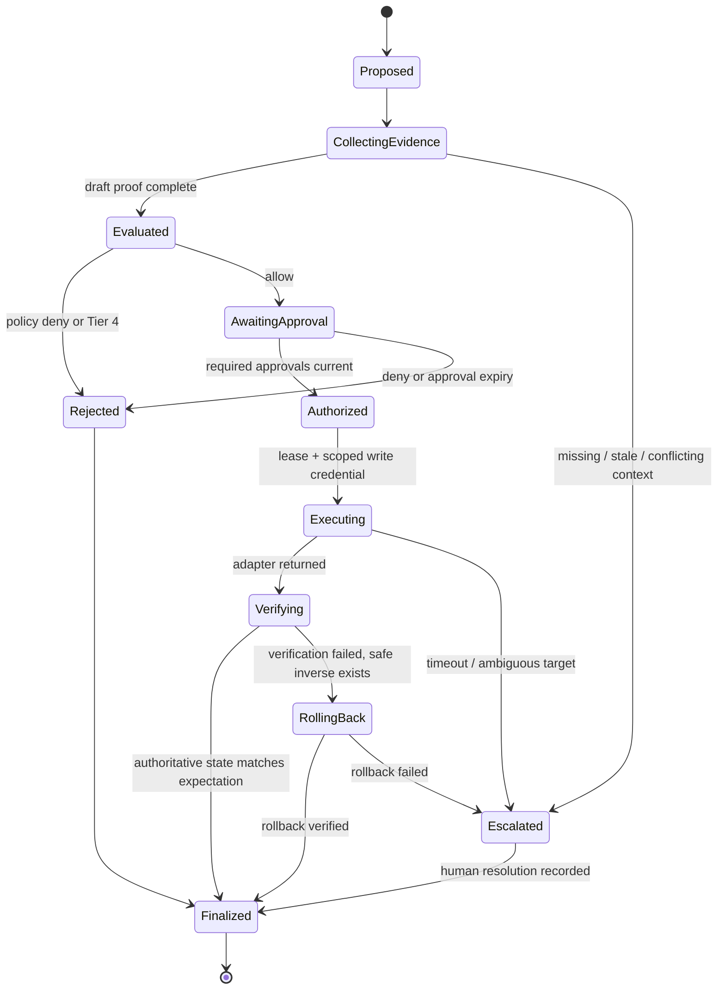

## 7. Flow: Slack identity binding and approvals (§8, §12; tasks M7.21–M7.25)

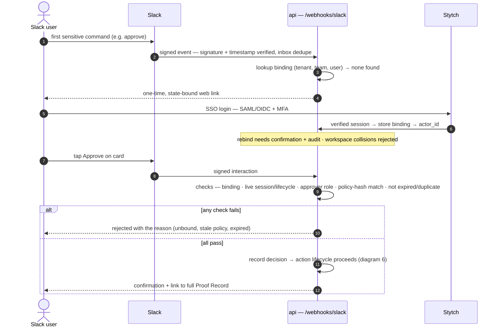

## 8. Flow: connector ingestion → canonical graph (§9–§10; tasks M2–M3, M5)

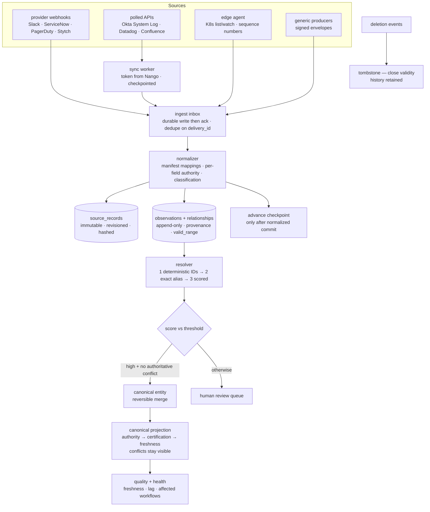

## 9. Flow: Proof Record lifecycle (§13; tasks M6.13–M6.19)

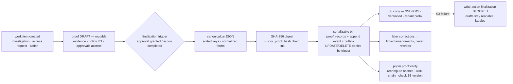

## 10. MVP-2 flows (gated on Gate B + 30-day safety hold; epics N1–N2)

### Employee self-service (N1)

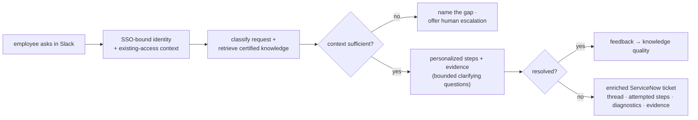

### Incident enrichment and guided diagnosis (N2)

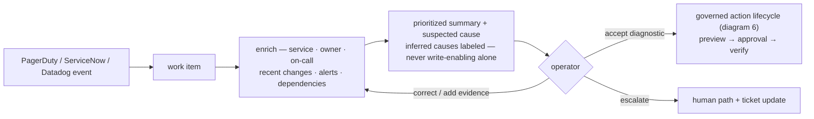
