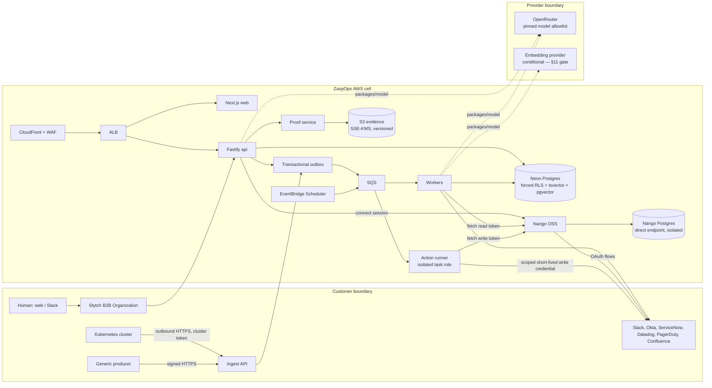

# ZaspOps Technical Implementation Plan

**Version 2.2 — 2026-08-12.** Supersedes v1 (archived in `docs/internal/archive/`). Product scope is unchanged from the PRD. This revision simplifies the build, resequences work into vertical slices with an early demoable gate, rebuilds the work breakdown into 10–15 minute tasks with explicit dependencies, and adds a UI ↔ API coverage map. §2 records every descope decision and its reintroduction trigger; §2.5 logs the founder decisions (v2.1: self-hosted Nango OSS for connections; v2.2: semantic retrieval is evidence-gated — built only if the §11 spike shows significant value).

## 1. Purpose, scope, staging

Build ZaspOps as a multi-tenant enterprise context, identity, policy, evidence, and governed-action platform that layers over systems of record. The first release lets authorized operators investigate infrastructure blast radius and request, approve, provision, verify, expire, and revoke time-bound Okta access — every answer and action carrying a reconstructable Proof Record.

**MVP-1 (P0):** temporal Enterprise Context Layer; core Actor/Resource/Capability/Entitlement/Activity/Work/Policy/Evidence contracts; provenance/authority/freshness/conflicts; Stytch SSO/SCIM/RBAC; web investigation console; Slack-bound operator questions and approvals; launch integrations (Slack, Okta, ServiceNow, Kubernetes read-only, Datadog, PagerDuty, Confluence); generic signed ingest API; evidence-bound Ask over graph + lexical retrieval (semantic/pgvector retrieval sits behind the §11 evidence gate); deterministic policy and risk tiers; immutable Proof Records; allowlisted actions (ticket create/update/comment, notify, change draft, time-bound Okta group membership).

**MVP-2 (P1):** curated Slack self-service with enriched ITSM escalation; incident enrichment and guided diagnosis; signed edge command channel and one reversible non-production Kubernetes action; expanded admin/quality; PDF export; GitHub/AWS context and policy-scoped MCP/public APIs after their gates pass.

**Non-goals (unchanged from PRD):** ITSM/IAM/observability replacement; workflow builder/marketplace; unrestricted natural-language production execution; Tier 4 execution; direct graph editing; human sessions as workload identities; cross-tenant retrieval; any ePHI processing before the BAA/technical gates in §19.

**Safe defaults.** One AWS region per deployment cell (`us-west-2` absent residency requirements). Shared-schema multi-tenancy with immutable `tenant_id` and forced RLS; dedicated cells only after commercial approval. All targets in this document are recommended targets, not claimed achievements. SOC 2 and HIPAA readiness are control programs, not certification claims.

## 2. What changed from v1

Guiding rule: **a component earns its place only if an MVP-1 workflow or a SOC 2 control requires it.** Everything else is cut with a written reintroduction trigger. The governance core — tenant isolation, provenance, deterministic policy, Proof Records, verification, fail-closed writes — is untouched; the cuts are infrastructure sprawl and premature platformization.

### 2.1 Descope decisions

| v1 choice | v2 decision | Why | Reintroduce when |
|---|---|---|---|
| Self-hosted Nango **Enterprise** (5 ECS services + OpenSearch + Valkey + separate DB) | **Self-hosted Nango OSS** (v2.1), scoped to what the free tier verifiably provides: OAuth connection UX, credential storage, token refresh, API-key connections, HTTP proxy. ZaspOps owns sync scheduling, provider webhooks, normalization, provenance | Enterprise-only features (managed sync functions, webhooks-from-Nango, dashboard RBAC/OTel, SLA) aren't needed when ZaspOps owns sync + provenance anyway; OSS keeps the credential plumbing at a server + isolated-Postgres footprint | Nango Cloud/Enterprise if managed syncs, webhooks-from-Nango, or connector-builder RBAC become necessary |
| Step Functions Standard for approvals/actions | Postgres state machine + SQS delays/retries + minute-level sweeper (the sweeper existed in v1 anyway) | One orchestration paradigm; removes history-cap workarounds and a separate real-AWS test rig | Multi-day, multi-system sagas beyond approval/verify lifecycles |
| EventBridge custom bus | Outbox → SQS direct; EventBridge Scheduler for cron only | Consumers are fixed and known at MVP | External/customer event consumers or dynamic fan-out |
| OPA/Rego signed bundles | Versioned TypeScript policy package with content-hashed bundles, identical input/output contract (§12) | Same determinism, versioning, and auditability; one language; no bundle-signing infra | Customers author their own policies |
| `model-gateway` as separate deployable | `packages/model` library with lint-enforced import boundary; egress allowlists at the ECS task level | The boundary is code-level; a network hop adds ops without adding security | A second runtime needs model access, or per-model network isolation is required |
| Valkey/Redis as an app dependency | Postgres + in-memory limits + WAF rate rules (Nango's self-contained stack manages its own storage) | MVP app volumes don't need a cache tier | Measured hot-path contention |
| Edge mTLS private CA + signed command channel + encrypted disk spool in MVP-1 | MVP-1 agent is read-only: outbound HTTPS, per-cluster bearer token, re-list on restart. Command channel (with signing ADR) lands in MVP-2 with the first edge action | MVP-1 has no Kubernetes writes, so the command channel guarded nothing | MVP-2 edge action (N3) |
| Per-tenant Merkle roots + S3 Object Lock decision | Append-only tables + per-tenant hash chain + S3 versioned SSE-KMS copies + `proof:verify` CLI | Tamper evidence is preserved; Merkle signing adds ceremony without a new guarantee at this trust model | A regulator or customer requires externally verifiable anchoring |
| 4 AWS accounts | 3 accounts: `prod`, `staging`, `log-archive` (logs + backup copies) | Separation-of-duties kept; one fewer account to operate | Contractual backup isolation |
| Neon PrivateLink | Public Neon endpoint + `verify-full` TLS | PrivateLink is same-region, capped at 10 configs, and not needed for design partners | An enterprise contract requires private networking |
| LocalStack **and** ephemeral real-AWS test rigs | LocalStack (S3/SQS) for local dev; the staging deploy + smoke suite is the real-AWS fidelity gate; nightly real-Neon RLS/pooler job | One fidelity story instead of two | Staging contention or flakiness makes per-PR isolation worth it |
| Monthly partitioning of 5 tables + BRIN | Plain tables + indexes + retention delete jobs | Premature at design-partner scale | Row counts or purge cost cross agreed thresholds |
| AsyncAPI 3.0 | JSON Schema event contracts in `packages/contracts` | No external event consumers exist | Public event API ships |
| Chaos/soak/mutation testing; manual WCAG audit | Targeted failure-injection tests; automated a11y checks in CI | Keeps the signal, cuts the ceremony | Pre-GA hardening |
| 10M-entity / 100M-observation / 100 eps load envelope | Partner-scale envelope: 5 tenants, 250 operators total, 1M entities, 10M observations+edges, 25 events/s sustained / 100 burst, 10 concurrent investigations, 5 actions/min | Test what launch actually needs; revise from partner telemetry | Before each scale-up gate |
| HIPAA vendor BAA workstreams on the MVP path | Data classification + fail-closed ePHI flag + encryption/audit/retention foundations now; the BAA chain (AWS, Neon, Stytch, model providers) is a gated track opened by a real regulated prospect | Compliance-*ready* posture without premature procurement; no launch-partner profile involves ePHI | First healthcare/regulated design partner signs |
| Build a control-evidence collector | Adopt a compliance automation platform (Vanta/Drata class) | Buy, don't build, SOC 2 evidence plumbing | Only if a platform gap appears |

### 2.2 Kept deliberately (the enterprise/compliance core)

Stytch B2B (SSO/SCIM/RBAC); Neon Postgres with forced RLS, composite tenant keys, and the **real-Neon pooler gate**; TypeScript monorepo (Fastify/Next.js/Turborepo) + Go edge agent; isolated `action-runner` with separate write credentials; transactional outbox + idempotency keys everywhere; append-only observations/relationships with provenance, authority, freshness, conflicts; deterministic policy separated from models; risk tiers and approvals; verification-before-completion with rollback-or-escalate; immutable Proof Records + hash chain + S3 copies + verify CLI; append-only audit events; OTel with redaction; fail-closed feature flags and kill switches; CloudFront+WAF+ALB+ECS Fargate; release gates and the 100-replay write-enable harness.

### 2.3 v1 defects this revision fixes

1. **Task granularity.** v1's 80 rows were each "one focused PR" — multi-day epics. §21 rebuilds the breakdown into ~205 tasks sized 10–15 minutes each (plus the 6-task conditional R1 retrieval package), with per-task dependencies and verify commands, per the sizing rule in §23.
2. **Layer-cake sequencing.** v1 built the entire data layer, then all ingestion, then retrieval, then policy, then UI — first demoable product near the end. v2 sequences a vertical slice: a read-only blast-radius investigation demo (Gate A) lands at milestone M4 with two connectors, before the remaining connectors and the write path.
3. **Dependency bugs.** v1 T08.1 (auth shell) depended on T05.2 (citation validator) — wrong layer. v1 T08.7 (self-service with enriched tickets) omitted its dependency on T06.7 (ServiceNow write actions). v1 chained Proof Records behind the work/approval service (T07.1 → T06.3), which forced all UI behind the action stack even though the read-only alpha needs only evidence-view drafts; v2 splits proof *drafts* (evidence view, M4) from proof *finalization* (needs work items, M6).
4. **Missing external prerequisites.** Sandboxes (Okta, ServiceNow PDI, Slack workspace, Datadog/PagerDuty/Confluence) and vendor sign-ups were implicit; §21.0 makes them explicit blocking tasks.
5. **UI/API coverage was implicit.** §14 now maps every MVP-1 screen and Slack interaction to concrete endpoints, and every endpoint has a build task sequenced before its UI task.

### 2.4 PRD flags (PRD not edited by this revision)

- PRD launch-integration table lists Kubernetes "bounded actions" as P0, but the PRD's own MVP-1 action catalog contains no Kubernetes action (they're MVP-2). The action catalog governs; treat the table cell as MVP-2.
- The PRD console list includes "incident and request queue" — incidents are MVP-2; MVP-1 console scope is investigation, access, approvals, proof, admin/quality/certification.
- The 8-week-to-production business goal is achievable only in the PRD's own read-only-first deployment sequence: read-only production (Gate A scope) ≈ weeks 6–8; write-enabled ≈ weeks 10–12. Set partner expectations accordingly.

### 2.5 Founder-decision amendments (v2.1 2026-08-10; v2.2 2026-08-12)

1. **Nango returns as self-hosted OSS, scoped to connections.** v2.0 replaced Nango Enterprise with fully hand-rolled connector auth. Founder decision: run the OSS self-hosted version as the connection/credential layer — minimal footprint, easy integration onboarding. Its scope is deliberately what the free tier provides (OAuth flows, credential storage, token refresh, API-key connections, HTTP proxy); ZaspOps keeps sync scheduling, provider webhooks, normalization, and provenance. v1's operational caveats still apply to OSS and carry over: Nango needs a direct (non-pooled) Postgres connection, its encryption key cannot rotate (compensating-control exception; no PHI credentials until security accepts it), and it is never the evidence system of record. Verify the exact OSS feature set against Nango's current self-hosting docs at bootstrap; if a needed feature turns out Enterprise-gated, the fallback for that provider is the v2.0 direct-connector path.
2. **(2026-08-10, superseded by 3)** Semantic retrieval was briefly made unconditional MVP-1 scope.
3. **(2026-08-12) Semantic retrieval is evidence-gated.** Founder direction: use embeddings **only if they add significant value**. MVP-1 ships graph + lexical (`tsvector`) retrieval. A labeled retrieval eval establishes the lexical baseline (M5.21–M5.22); a timeboxed offline spike measures hybrid uplift with a script — no schema or pipeline built (M5.23); an ADR adopts embeddings only if the uplift clears the §11 thresholds (M5.24). If adopted, the pre-specified R1 package (EmbeddingProvider, pgvector HNSW, hybrid fusion) is built before Gate B; if not, the gate re-runs on the knowledge corpus at MVP-2 self-service (N1) entry. pgvector stays installed either way, so later adoption is an expand-only migration, not a rework.

Lesson applied: capability investments are decided by measured value — neither cut by default nor built by default.

## 3. Architecture principles

1. Context before action; proof before approval; verification before completion. Fail closed on missing evidence, quality, authorization, policy, approval, target, credential, or verification.
2. Preserve source records; normalize without overwrite; canonical values selected by configured authority with conflicts kept visible.
3. Human sessions authenticate humans only. Workloads use separately registered, scoped identities.
4. LLMs may extract, summarize, and propose; deterministic policy and tool authorization live outside models.
5. Modular monolith with a handful of independently deployed components (web, api, worker, action-runner, edge-agent). No microservice splits before they're forced.
6. Version everything that affects a decision: OpenAPI, JSON Schemas, connector manifests, prompts, models, policy bundles, migrations. Transactional outbox and idempotency throughout.
7. Minimize privilege and data movement. Tenant and field filtering before retrieval and prompts; scoped short-lived write credentials; outbound egress allowlists.

## 4. Topology

Per-flow diagrams (investigation, retrieval gate, access lifecycle, action state machine, Slack binding/approvals, ingestion, Proof lifecycle, milestone map, MVP-2 flows) live in `ZaspOps MVP Diagrams.md`.



**Trust boundaries.** Browser/Slack: TLS, WAF, CSRF on browser mutations, Slack signature validation, session validation, tenant never supplied by the client. SaaS/Nango: least-privilege per-tenant connections in Nango OSS (separate read vs write connections; non-connector platform secrets in Secrets Manager), webhook signature + replay checks on provider webhooks (which arrive directly at ZaspOps, not through Nango), raw payloads quarantined as source records; Nango's database is isolated (own role, direct endpoint) and never holds ZaspOps tenant tables. Cluster: outbound-only HTTPS with per-cluster rotatable token; no inbound exposure. DB: `verify-full` TLS; pooled endpoint for product traffic; direct endpoint for migrations only. Neon poolers are transaction-mode and don't support session `SET`, so tenant context must be transaction-local — production is blocked on the real-Neon `rls_pooler_context_test` (M1.18). Model boundary: `packages/model` only — completions and embeddings — pinned allowlist, classification-based routing, redaction before prompts; Restricted free text is never embedded. Action boundary: action definition + tenant + re-resolved target + policy/proof hash + idempotency key, then a scoped credential. Admin boundary: JIT break-glass with dual approval and audit; it never bypasses action policy or Proof Records.

## 5. Technology decisions

| Area | Selection | Rejected/deferred | Rationale |
|---|---|---|---|
| Stack | TypeScript, pnpm/Turborepo, Next.js, Fastify, Node workers | NestJS; multiple control-plane languages | JSON Schema/OpenAPI directly from Fastify; one language minimizes contract drift |
| Edge | Go binary + Helm chart, read-only in MVP-1 | Node agent; inbound controllers | Small static Kubernetes client; outbound-only |
| Human identity | Stytch B2B (SAML/OIDC SSO, SCIM, sessions, RBAC) | Custom auth | Org-scoped connections; SCIM deactivation revokes sessions/roles |
| Database | Neon Postgres + pgvector (HNSW; `vector` limit 2,000 dims) | Graph DB; separate vector DB | Transactional graph + RLS + audit + vectors in one system |
| DB endpoints | Pooled for app; direct for migrations | One path | Neon pooling is transaction-mode; see pooler gate |
| ORM/migrations | Drizzle + reviewed SQL via node-pg-migrate | Prisma schema-push | Typed access with explicit RLS/CTE/transaction control |
| SaaS integration | Self-hosted **Nango OSS** for OAuth/API-key connections, token storage/refresh, proxy; ZaspOps-owned sync workers, provider webhooks, normalization | Nango Enterprise self-hosted; fully hand-rolled OAuth per provider | OSS covers credential plumbing at a small footprint; Enterprise-only sync/webhook/RBAC features are unnecessary because ZaspOps owns sync + provenance. Nango needs a direct (non-pooled) Postgres connection and its encryption key cannot rotate — see §10 |
| LLM | `packages/model` → OpenRouter, pinned OpenAI-family default, allowlisted fallbacks, schema-validated output | Direct provider SDKs anywhere else | One audited path; mid-stream failures restart from evidence |
| Policy | Versioned, content-hashed TypeScript policy package | OPA/Rego (deferred); LLM policy (never) | Deterministic, versioned, reviewable in the same repo/language |
| Embeddings | Evidence-gated (§11): lexical baseline first; adopt only if a timeboxed spike shows significant uplift (M5.24 thresholds). If adopted: configurable `EmbeddingProvider` behind `packages/model`, pinned model/dimensions, pgvector HNSW | Building the pipeline by default; assuming OpenRouter embedding support (unverified); separate vector DB | pgvector stays installed so adoption is an expand-only migration; persist model/version/dimensions; reindex on model change |
| Runtime | ECS Fargate | EKS | Task-level isolation without a control plane to run |
| Ingress | CloudFront + WAF + ALB | API Gateway everywhere | ALB fits ECS/streaming; API Gateway when the public API ships |
| Durable work | Postgres outbox + SQS (+ DLQs) + EventBridge Scheduler | Step Functions; cron-only | At-least-once with idempotency; one paradigm |
| IaC/SDLC | OpenTofu, Docker Compose, GitHub Actions, Trivy + gitleaks + pinned digests + SBOM/Cosign (minimal) | Click-ops | Staging is the real-AWS gate |

**Dependency and version policy.** At bootstrap, select maintained LTS/stable releases; pin exact Node/Go/pnpm/package/image/provider versions in lockfiles and digests; ban floating tags. Automate patch PRs behind test gates. Major upgrades require an ADR plus compatibility/migration tests. Never invent version numbers; record each approved version in the repo.

## 6. Monorepo

```text
zaspops/
  apps/{web,api,worker,action-runner,edge-agent}/
  packages/{contracts,db,domain-core,ingest,connectors,policy,proof,actions,authz,retrieval,model,observability,ui-kit,testkit}/
  infra/{tofu/modules,tofu/envs/{staging,prod,log-archive},docker}/
  docs/adr/  scripts/  tasks/
```

Boundaries: `api` orchestrates but never calls target systems; only `action-runner` invokes targets. Only `packages/model` talks to model providers (lint-enforced). `ingest` owns normalization/provenance; connectors never write canonical tables directly. `domain-core` owns canonical projection/resolution/quality. `proof` accepts only validated, versioned decision inputs. Changes to `contracts` require a compatibility check and version bump.

## 7. Components and degradation

| Component | Role | Degraded behavior |
|---|---|---|
| web | Next.js operator/admin console | Cached shell + status; mutations visibly unavailable |
| api | Fastify OpenAPI, webhooks, commands | Persist retry-safe command; read-only if runner impaired |
| worker | Ingestion, resolution, indexing, quality, retention, sweepers | Visible backlog/staleness; never silent completeness |
| action-runner | Isolated write adapters + verification | Kill switch pauses; retries only via state machine |
| edge-agent | Cluster inventory/events (read-only MVP-1) | Buffers briefly, re-lists on restart; agent outage = stale connector, named |
| Nango OSS | Connection/credential service (OAuth flows, token storage/refresh, API-key connections, proxy) | Connection setup and refresh pause; syncs continue until tokens expire, then connectors show `auth_required`/`stale`; nothing else degrades |

API groups: `/v1/auth`, `/v1/entities`, `/v1/investigations`, `/v1/access-requests`, `/v1/approvals`, `/v1/actions` (status + proposals via parent resources), `/v1/proofs`, `/v1/certifications`, `/v1/admin/*`, `/v1/ingest`, and signed raw-body `/webhooks/{slack,stytch,servicenow,pagerduty}`. OpenAPI 3.1 generated from route schemas. Every event carries `event_id, event_type, schema_version, tenant_id, occurred_at, producer, correlation_id, causation_id, payload_ref`; payloads beyond safe queue size go to S3 by hashed reference (SQS limit applies).

Core events → consumers: `source.record.received` → normalizer; `context.observation.recorded` → resolver; `context.entity.changed` → projection/index/quality; `work.created` → policy/proof; `approval.requested` → Slack/web notify; `action.authorized` → runner; `action.executed` → verifier/proof; `entitlement.expiry.due` → revoker; `connector.reconcile.due` → checkpoint poller; `retention.enforce.due` → hold-aware purger. Scheduled jobs: minute-level timeout sweeper; 5-minute connector freshness/reconcile; hourly expirations/retries; daily quality/retention; weekly metadata export; monthly access-review export.

## 8. Multi-tenant identity and authorization

Immutable internal `tenant_id` (UUIDv7) at provisioning, uniquely bound to `stytch_organization_id`; vendor IDs are never universal keys. Immutable `actor_id` for people, teams, services, agents, and workload identities; `actors` unique on `(tenant_id, external_issuer, external_subject)`; aliases are temporal records. Valid Stytch session → org/member → active Person Actor; lifecycle and tenant membership rechecked per request; high-risk operations recheck internal membership directly (SCIM revocation must bite immediately even if a JWT is still fresh).

Stytch handles org membership, SSO/MFA/session posture, and coarse roles. Map Stytch roles to internal `operator, approver, connector_admin, policy_admin, auditor, tenant_admin, breakglass`; fine-grained permissions live in ZaspOps. Authorization order per invocation: tenant/status → RBAC resource/action → ABAC (environment, classification, target scope, source authority/freshness, delegation, risk/time limits) → policy decision → RLS-scoped query → Proof requirement.

Delegation is a time-valid edge (delegator, delegate, capability/target selector, max risk, data class, expiry, revocation); permissions intersect, never union. Agent executions record accountable Agent and executing runtime/workload identity. Human sessions never authenticate workloads. ECS task roles, edge cluster tokens, and future agent credentials register in `workload_identities` with scope, expiry, rotation, status.

Slack user IDs are aliases, not authorization. First sensitive operation issues a one-time state-bound web link; after Stytch auth, store verified `(tenant_id, slack_team_id, slack_user_id) → actor_id`. Require active workspace install + active actor; rebind only with confirmation and audit; reject workspace collisions.

**RLS roles:** `zaspops_migrator` (owns schema, direct endpoint), `zaspops_app` (non-owner, no BYPASSRLS), `zaspops_audit_writer` (append-only), `zaspops_breakglass_reader` (JIT read-only). Table owners bypass RLS by default, so FORCE RLS on every tenant table:

```sql
ALTER TABLE entities ENABLE ROW LEVEL SECURITY;
ALTER TABLE entities FORCE ROW LEVEL SECURITY;
REVOKE ALL ON entities FROM PUBLIC;
GRANT SELECT, INSERT, UPDATE, DELETE ON entities TO zaspops_app;
CREATE POLICY tenant_guard ON entities AS RESTRICTIVE FOR ALL TO zaspops_app
 USING (current_setting('app.tenant_id', true) IS NOT NULL)
 WITH CHECK (current_setting('app.tenant_id', true) IS NOT NULL);
CREATE POLICY tenant_rows ON entities FOR ALL TO zaspops_app
 USING (tenant_id = current_setting('app.tenant_id', true)::uuid)
 WITH CHECK (tenant_id = current_setting('app.tenant_id', true)::uuid);
```

Set tenant context with transaction-local `set_config(..., true)` inside an explicit transaction wrapper only. The combination with Neon transaction pooling must be proven on real Neon (M1.18) before any tenant data path ships; if it fails, fall back to signed tenant-capability inputs to rigorously validated `SECURITY DEFINER` access functions — never session `SET`. Use tenant-composite PKs/FKs/uniques because integrity checks bypass RLS and can leak cross-tenant existence.

Break-glass: isolated Stytch break-glass organization; named incident and reason; security + on-call dual approval; MFA; JIT ≤ 60 minutes; explicit tenant/object scope; auto-expiry; tenant notification; next-business-day review. Break-glass never bypasses action policy or Proof Records.

## 9. Postgres schema, temporal graph, resolution

All tenant tables carry `tenant_id`, UUIDv7 IDs, timestamps, forced RLS, composite tenant keys. Secrets live in Secrets Manager, never in domain tables.

| Area | Tables and key constraints |
|---|---|
| tenants/actors | `tenants(tenant_id PK, stytch_organization_id UNIQUE, region, tier, state)`; `actors(...UNIQUE(tenant_id, external_issuer, external_subject))`; `actor_aliases`, `memberships`, `role_bindings`, `delegations`, `workload_identities`, `slack_bindings` (active partial uniques) |
| schema registry | `schema_registry(namespace, version, core_type, json_schema, compatibility, hash, state)` — internal registry per PRD; domain-pack install tables deferred to the first external pack |
| sources | `connectors`; `connector_checkpoints(...UNIQUE(tenant_id, connector_id, stream))`; `source_records(...UNIQUE(tenant_id, connector_id, source_type, external_id, revision), content_hash, payload_ref, deleted_at)`; `ingest_inbox(provider, delivery_id UNIQUE, received_hash, status)` |
| graph | `entities(core_type, domain_type, canonical_name, lifecycle_state)`; append-only `observations(attribute_path, value_json, value_hash, source_record_id, authority, confidence, certification_state, observed_at, ingested_at, valid_range, superseded_at)`; `relationships(from_entity_id, to_entity_id, relationship_type, source_record_id, authority, confidence, valid_range, state)`; indexes on active from/to/type |
| retrieval | `documents(entity_id, source_record_id, title, body_ref, classification, authority, freshness_at, valid_range, tsv)` + GIN; `document_chunks(document_id, ordinal, text, text_hash, tsv, token_count)` + GIN. R1 — only if the §11 gate adopts embeddings — adds `embedding_model`, `embedding vector(n)`, and an active/model/tenant partial HNSW index |
| policy/work/action | `policies` (config rows), `policy_decisions(bundle_hash, input_hash, output_json, result)`; `entitlement_catalog`; `work_items(kind, status, requester_actor_id, target_ref, risk_tier, idempotency_key, UNIQUE(tenant_id, kind, idempotency_key))`; `action_definitions`, `approvals`, `action_executions`, `verification_results`, `rollback_attempts` |
| proof/audit | `proof_records(work_id UNIQUE, canonical_json, canonical_hash UNIQUE, prior_proof_hash, finalized_at)`; `proof_amendments`; append-only `proof_events`; append-only `audit_events`; `outbox_events`, `idempotency_keys`, `retention_holds`, `export_jobs`, `feature_flags` |

`observed_at` is source time; `received_at`/`ingested_at` are ZaspOps time; `valid_range = [from, to)`. Historical observations and edges are never mutated: deletions close validity with a tombstone revision. Canonical views select current valid values by authority → certification → freshness → deterministic tiebreak; conflicts stay visible. No partitioning in MVP (plain indexes + retention jobs); add partitions when growth or purge cost demands (§2.1).

Postgres is not a graph database: traversal uses bounded recursive CTEs with the tenant predicate in anchor and recursive terms, max depth 6, max 2,000 nodes, 2-second statement timeout, relationship-type allowlist, cycle detection, cursor pagination. Precompute Tier-1 topology snapshots if traversal SLIs miss.

Entity resolution: (1) source immutable keys (Kubernetes UID; Okta/ServiceNow/PagerDuty/Datadog IDs; Slack team+user); (2) exact normalized aliases; (3) type-compatible scored candidates (name/owner/namespace/account/evidence overlap) — auto-merge only above a high configured threshold with no authoritative conflict, otherwise a review candidate. Merges move canonical pointers and aliases and are reversible, never destructive.

## 10. Ingestion and connector contract

Division of labor: **Nango OSS (self-hosted)** owns connection UX, OAuth flows, credential storage, and token refresh for connectors, plus an HTTP proxy sync workers may use. **ZaspOps** owns everything else: manifests, field filtering, authority, sync scheduling and polling, provider webhooks, raw payload retention, normalization, schema validation, provenance, resolution, quality, retention. Enterprise-only Nango features (managed sync functions, webhooks-from-Nango, dashboard RBAC) are not used — syncs are ZaspOps workers pulling tokens from Nango at run time.

Every connector ships a versioned manifest declaring: provider; streams and sync cadence; entity/relationship mappings to registered schema types; per-field/edge authority; external-ID and deletion strategy; webhook validation; data classes and filters; freshness target; rate/concurrency; retry classification; write action definitions (if any — rejected unless verification and rollback-or-escalation are declared); and fixtures. The normalized envelope carries schema version, tenant/connector, source kind/external ID/revision/observed time, record type, upsert/delete, payload+hash, authority, classification, correlation ID.

Webhook and generic deliveries persist to `ingest_inbox` transactionally; acknowledge only after the durable write; normalization is queued. Checkpoints advance only after normalized commit; replay runs by cursor/snapshot into a new ingest run and never overwrites source records. Deletes tombstone/close validity while retaining provenance. Health states: `healthy, degraded, stale, auth_required, schema_failed, paused, revoked`, each showing lag, last source event, last success, authority classes, and affected workflows. Per-connector concurrency and retry-with-jitter for classified-transient failures only; DLQ + replay; S3 indirection for large payloads.

Connector auth: every provider credential lives in Nango as a per-tenant connection — OAuth where the provider requires it (Slack), API-key/token connections elsewhere (Okta, ServiceNow, Datadog, PagerDuty, Confluence) — always as **separate read and write connections**; platform (non-connector) secrets stay in Secrets Manager. Nango's backing Postgres is physically isolated from ZaspOps domain schemas, uses its own role and a separately budgeted **direct** (non-pooled) Neon connection — Nango rejects transaction-mode poolers. Its encryption key cannot rotate: record an approved compensating-control exception (access restriction, immutable key version, emergency redeploy/reconnect runbook) and forbid PHI credentials until security accepts it. Nango's cache is never the evidence system of record. Webhooks are used where the source offers them and arrive directly at ZaspOps `/webhooks/*` (Slack, ServiceNow, PagerDuty, Stytch); polling with checkpoints elsewhere (Okta System Log, Datadog, Confluence).

**Kubernetes edge (MVP-1, read-only).** Helm chart creates namespace, read-only ClusterRole, service account, network policy, pinned image. Bootstrap exchanges a one-time token for a per-cluster rotatable bearer token. The agent watches nodes/namespaces/workloads with `resourceVersion`/bookmarks, batches envelopes with monotonic sequence numbers, re-lists on restart. No command channel exists in MVP-1; the signed command protocol (action ID, target UID+resourceVersion, proof/policy hash, nonce, expiry, signature) ships with the first edge action in MVP-2 behind its own ADR and drill.

**Generic ingest API (MVP-1, PRD requirement).** `POST /v1/ingest/events` accepts HMAC-signed envelopes from registered workload identities, enforces schema registration, payload/rate caps, and replay-safe acknowledgment — this is how DCGM/Slurm/fabric telemetry integrates before native connectors exist.

## 11. Retrieval and AI orchestration

Pipeline: (1) resolve tenant/actor/RBAC+ABAC/classification and named entities; (2) structured graph facts under RLS; (3) lexical `tsvector` chunks filtered by tenant/classification/entity/source/authority/freshness; (4) rank by authority/certification/freshness/directness; (5) build an EvidencePacket (fact/edge/observation/source IDs, fields, times, quality, redactions); (6) model emits typed claims citing packet IDs; (7) validate JSON Schema + citations + claim support + scopes; strip or label unsupported claims, else return an evidence-only answer or escalate. If the gate below adopts embeddings, step 3 gains a parallel pgvector candidate query under **identical** filters, fused by reciprocal rank before re-ranking, served by partial ANN indexes.

**Retrieval decision gate — embeddings only if they add significant value.** Measure before building: (a) a labeled retrieval set over the runbook/knowledge corpus establishes the lexical baseline (M5.21–M5.22); (b) a timeboxed offline spike embeds that same corpus via a hosted API — script only, no schema or pipeline changes — and scores hybrid (RRF) against the baseline (M5.23); (c) the M5.24 ADR adopts embeddings only if hybrid improves recall@10 by ≥10 percentage points or cuts answer-eval failures attributed to retrieval misses by ≥30% (defaults — tune with design-partner data). On adopt, the R1 package (§21) ships before Gate B; on defer, stay lexical and re-run the gate on the self-service knowledge corpus at N1 entry. Chunking (400–800 tokens, ~80-token overlap, heading-aware, carrying source heading/entity/revision/hash/classification/validity) ships in MVP-1 regardless — it serves lexical retrieval and the spike. If R1 is built: the `EmbeddingProvider` contract is `providerId, modelId, dimensions` plus `embed({tenantId, texts, classification})`; never embed secrets; omit or redact Restricted free text; persist model/version/dimensions and reindex on model change; the pinned default provider/model is a procurement/security decision and its dimension must match the HNSW index.

Only `packages/model` calls providers; lint bans provider SDKs elsewhere. Version prompts, output schemas, retrieval config, models, providers, and eval sets. Default OpenRouter request: explicit model/provider allowlist, `data_collection: deny`, ZDR, `require_parameters: true` for schema-critical calls, max-token caps, ≤5 tool turns. Privacy routing by classification: Public/Internal on the approved default route; Confidential on tenant-approved routes; Restricted/ePHI never reaches a model until the §19 gates pass — and Restricted free text is redacted or omitted from prompts regardless. Retry pre-stream 429/503 with `Retry-After`; a mid-stream failure restarts from evidence (no cross-provider failover mid-answer). None of this implies a BAA exists — see §19.

Treat retrieved connector text as untrusted data: delimit it; it can never alter system instructions, tool scopes, policy, routing, or egress. Tool calls are candidates, not authority — reauthorize each invocation, validate args, cap loops/cost/time, bind calls to policy and proof. Cache only redacted, tenant/actor-scoped read answers keyed by source freshness and policy version; never cache actions or approvals. A versioned eval corpus (citations, unsupported claims, injection, refusal, tool safety, latency/cost) runs in CI; promotion requires safety non-regression.

## 12. Deterministic policy and governed actions

`packages/policy` is a pure, deterministic TypeScript package: rule modules compiled into a **content-hashed bundle**; the hash is recorded on every decision exactly as v1 intended for Rego. Input: tenant/actor/workload/delegation, resource/target, classification, freshness/authority/conflicts, action definition version, environment, blast radius, time, approvals so far, limits. Output: `allow, risk_tier, reasons, required_evidence, required_approvals, constraints, credential_scope, verification_required, rollback_required, policy_bundle_hash`. Unknown or malformed input → deny. Policy config (entitlement catalog, SoD pairs, approval routes, tier overrides) is reviewed config-as-code seeded per tenant; the console renders it read-only in MVP-1 (authoring UI is post-MVP). Tiers: 0 inform; 1 narrow reversible; 2 controlled access; 3 elevated multi-approval; 4 recommendation-only. MVP-1 allowlists Tier 1–2 only.

Action lifecycle is a Postgres state machine (`Proposed → CollectingEvidence → Evaluated → AwaitingApproval → Authorized → Executing → Verifying → Finalized`, with `Rejected/Escalated/RollingBack` branches — semantics identical to v1's diagram). One command transaction creates the work item, proof draft, policy decision, and outbox event together. Timeouts and expirations are enforced by the minute-level sweeper; retries via SQS with attempt counters; exactly-once effects via the action lease `UNIQUE(tenant_id, action_definition_id, idempotency_key)` and one upstream idempotency token per execution.

The runner re-resolves the target (UID/version), obtains a scoped short-lived credential (logs fingerprint, never the secret), executes, then **verifies authoritative target state — an HTTP 200 is not success**. Failed verification triggers the separately policy-checked inverse action with recorded pre-state when safe; otherwise a named escalation. No safe rollback ⇒ no auto-execution.

## 13. Immutable Proof Records

A Proof Record is a historical decision snapshot: drafts change, finalized records never do. `proof.v1` contains requester/approver/accountable/executing identities and delegation chain; targets and resolved versions; source record IDs/revisions/hashes/times; fact/edge IDs; authority/freshness/conflicts; connector/schema/policy/action/prompt/model/provider versions; policy input/output hashes; approvals; execution, verification, and rollback plans and results.

Canonicalize to deterministic UTF-8 JSON (lexicographic keys, normalized numbers/timestamps, semantic array order, no insignificant whitespace); SHA-256 it. Finalization is one serializable transaction storing canonical JSON + digest + append event + `proof.finalized` outbox row, linking `prior_proof_hash` to form a per-tenant hash chain. UPDATE/DELETE on proof tables is denied by trigger and role grants; appends go through a guarded function. The canonical object is copied to a tenant-prefixed, versioned, SSE-KMS S3 bucket; S3 failure blocks finalization of write actions (drafts remain readable and labeled). Corrections create linked amendments or superseding records — never rewrites. `pnpm proof:verify --proof <id>` recomputes hashes, walks the chain, and checks the S3 object version and digest. JSON + console rendering is P0; PDF export is MVP-2.

## 14. UI ↔ API coverage map

Rule: **every UI flow's endpoints must exist as built, tested tasks sequenced before the UI task that consumes them** (§21 enforces the ordering). MVP-1 surfaces:

| Surface | Flow | Endpoints |
|---|---|---|
| Web: login/shell | SSO sign-in, session, tenant guard | Stytch redirect/callback; `GET /v1/auth/me` |
| Web: Ask / investigations | Create, list, view; ambiguity clarification | `POST /v1/investigations`; `GET /v1/investigations`; `GET /v1/investigations/{id}`; `POST /v1/investigations/{id}/clarification` |
| Web: context explorer | Search entities; entity detail with provenance; neighbors | `GET /v1/entities?query=`; `GET /v1/entities/{id}`; `GET /v1/entities/{id}/graph` |
| Web: proof pane | Draft evidence view; finalized record; amendments | `GET /v1/proofs?work_id=`; `GET /v1/proofs/{id}` |
| Web: act-from-answer | Create ticket / notify owners / change draft from an investigation | `POST /v1/investigations/{id}/actions` |
| Web: access request | Catalog picker, submit, status timeline | `GET /v1/entitlement-catalog`; `POST /v1/access-requests`; `GET /v1/access-requests`; `GET /v1/access-requests/{id}` |
| Web: approvals inbox | List, decide with proof | `GET /v1/approvals`; `POST /v1/approvals/{id}/decision` |
| Web: action status | Targets preview, verification, rollback, escalation | `GET /v1/actions/{id}`; `GET /v1/actions?work_id=` |
| Web: connector admin | Add/configure, pause/resume, health | `GET/POST /v1/admin/connectors`; `POST /v1/admin/connectors/{id}/pause\|resume`; `GET /v1/admin/connectors/{id}/health` |
| Web: authority & freshness | View/update rules and thresholds | `GET/PUT /v1/admin/authority-rules`; `GET/PUT /v1/admin/freshness-thresholds` |
| Web: policy view | Read-only risk tiers, routes, catalog | `GET /v1/admin/policy` |
| Web: quality dashboard | Coverage, staleness, affected workflows | `GET /v1/admin/quality` |
| Web: certification queue | Review/certify owners, dependencies, runbooks | `GET /v1/certifications/queue`; `POST /v1/certifications/{id}/decision` |
| Web: audit & export | Query audit events; export bundles | `GET /v1/admin/audit-events`; `POST /v1/admin/exports`; `GET /v1/admin/exports/{id}` |
| Web: flags/kill switches | View/toggle tenant flags | `GET/PUT /v1/admin/flags` |
| Slack: identity bind | One-time link → Stytch → verified binding | `POST /v1/auth/slack/bind-link`; web callback; `/webhooks/slack` |
| Slack: ask | Question → threaded evidence answer + console link | `/webhooks/slack` → `POST /v1/investigations` (server-side) |
| Slack: access request | Modal submit | `/webhooks/slack` → `POST /v1/access-requests` (server-side) |
| Slack: approvals | Card approve/deny with proof summary | `/webhooks/slack` → `POST /v1/approvals/{id}/decision` (server-side) |
| Slack: notifications | Approval requests, action outcomes, escalations | Outbound via notify adapter |
| Machine: generic ingest | Signed envelope submission + replay ack | `POST /v1/ingest/events`; `POST /v1/ingest/edge/register` |

Deferred to their PRD phase: public/partner API and MCP (P1), PDF export (P1, i.e. MVP-2), incident/self-service surfaces (MVP-2 — their endpoints are specified in N1/N2 before their UI tasks).

## 15. AWS environments and security baseline

Three accounts: `prod`, `staging`, `log-archive` (org CloudTrail destination + backup copies). Dev is local. Each app account: three-AZ VPC, public subnets for ALB/NAT only, private ECS services, VPC endpoints where practical. CloudFront → WAF (managed rules + rate rules) → ALB for web/API/webhooks. ECS tasks have no public IPs and per-service task roles/security groups. Egress allowlisted (DNS/SG) to Stytch, OpenRouter, connected SaaS, telemetry, Neon. Route 53 + ACM for DNS/TLS.

Neon over public endpoint with `verify-full` TLS (PrivateLink deferred, §2.1). Nango OSS runs as its own ECS service with an isolated backing database — a separate Neon database and role over the **direct** endpoint, with an alarmed connection budget — sharing nothing with ZaspOps domain schemas. Neon PITR covers short-window recovery; Proof/audit artifacts export to S3 for longer retention than Neon's backup window. KMS CMKs per environment/data class. Secrets Manager holds DB/provider/connector credentials with rotation where supported. S3 buckets: raw payloads, evidence, exports, app logs, CloudTrail, backups — all SSE-KMS, versioned, public-blocked, lifecycle-managed, TLS-only bucket policies. Org multi-region CloudTrail into log-archive with data events enabled explicitly; Config recorder + Security Hub + GuardDuty (including ECS runtime monitoring) on in all app accounts — enablement is IaC, not a build project.

Local dev: Docker Compose runs Postgres(+pgvector), LocalStack (S3/SQS), and Nango OSS (server + its own Postgres); the queue abstraction uses an in-process driver for unit tests. Staging deploys are the real-AWS fidelity gate; a nightly CI job runs the RLS matrix against real Neon pooled endpoints.

```bash
corepack enable && pnpm install
cp .env.example .env.local
pnpm infra:local:up && pnpm db:migrate && pnpm db:seed
pnpm dev
pnpm test && pnpm rls:test
```

Env var inventory (names only, values never committed): `NODE_ENV, APP_BASE_URL, AWS_REGION, DATABASE_POOL_URL, DATABASE_DIRECT_URL, STYTCH_PROJECT_ID, STYTCH_SECRET_REF, OPENROUTER_API_KEY_REF, MODEL_ALLOWLIST_CONFIG_REF, S3_EVIDENCE_BUCKET, S3_RAW_BUCKET, KMS_KEY_ARN, SQS_*_URL, OTEL_EXPORTER_OTLP_ENDPOINT, SLACK_CLIENT_ID, SLACK_CLIENT_SECRET_REF, SLACK_SIGNING_SECRET_REF, EDGE_TOKEN_PEPPER_REF, NANGO_BASE_URL, NANGO_SECRET_KEY_REF, NANGO_DATABASE_DIRECT_URL_REF, EMBEDDING_PROVIDER_CONFIG_REF, FEATURE_FLAG_DEFAULTS_REF`.

## 16. SLOs, capacity, backup/DR, runbooks

| SLI | Recommended target | Degraded behavior |
|---|---|---|
| Valid API acknowledgement | 99.9% monthly < 1 s | Durable command/inbox, async status |
| Common evidence answer | p95 < 10 s (sources available) | Progressive or evidence-only result, gaps named |
| Graph entity lookup | p95 < 500 ms | Bounded/cached query; reject expensive traversal |
| Proof initial render | p95 < 5 s | Known evidence first, progressive completion |
| Action status | p95 < 2 s after source response | Pending/reconcile; never premature success |
| Tenant isolation breach or proof/policy/verification omission on a write | 0 tolerated | Containment + global writes kill switch |

**Capacity validation envelope (a validation target, not a claim):** before broadly enabling writes, load-test one cell at 5 tenants / 250 total operators / 1M canonical entities / 10M observations+edges / 25 events/s sustained and 100/s burst / 10 concurrent investigations / 5 governed actions per minute — covering steady state, burst, backfill/replay, connector outage, vector-query (if embeddings adopted), approval, and verification mixes while measuring each SLI, queue age, pool usage, storage growth, provider cost, and tenant fairness. Revise from design-partner telemetry before each gate.

Autoscale api/web on CPU/requests; workers on SQS oldest-age/depth; runner capped by per-tenant/action concurrency. Enforce hard admission limits.

**DR (recommended targets, not commitments):** service redeploy RTO 60 min; database recovery RPO 5 min / RTO 4 h via Neon PITR; S3 evidence versioned; weekly encrypted metadata/proof-index export; AWS Backup for AWS-managed stateful resources (it does not cover Neon). A Proof Record is finalized only after Postgres **and** S3 durably commit. Start at backup/restore posture; warm standby only for contractual need. Quarterly tabletop; semiannual restore drill in an isolated project recording measured RTO/RPO and corrective actions.

Runbooks: model outage (evidence-only mode); Neon outage (banner, block writes); queue backlog (throttle ingest, preserve actions); connector credential compromise (disable/rotate/reconnect); action timeout/ambiguity (hold/reconcile/escalate); suspected isolation breach (global containment); regional recovery. Feature flags per tenant/connector/workflow/action/model plus global `writes_disabled, model_disabled, edge_disabled` — all default fail-closed. Migrations are expand/contract; rollback is image/IaC version or a forward corrective migration, never blind DB reversal.

## 17. Observability

OTel traces/metrics/structured logs in api/worker/action-runner (and web server routes), exported through a collector sidecar with batching and a redaction processor. Attributes: environment/region/version/service, tenant hash (never raw tenant ID in shared views), connector/action/policy/model/prompt versions, correlation/work/proof IDs, classification. Redact headers/cookies/tokens, prompts, raw payloads, and PII before export; raw forensic material stays in tenant S3 with access audit.

Dashboards: API RED; queue age/DLQ; connector freshness/authority; resolution/conflicts; retrieval citations/unsupported claims; model + embedding latency/error/token/cost; policy denials; approvals; action verification/rollback; DB pools/RLS; Nango health/connection errors; proof finalization/hash. Alerts: SLO burn, DLQ > 0, stale connector, proof hash mismatch, write-event gap, RLS anomaly probe, credential age, provider budget/outage, restore failure, control service disabled, WAF abuse. Application `audit_events` and proof events are append-only and access-separated from operational logs; mirror material Stytch auth events into `audit_events` because Stytch retains them only 30 days.

## 18. Test strategy

- **Unit:** TS/Go logic, canonicalization, quality, resolution, policy, redaction, idempotency.
- **Contracts:** OpenAPI break checks; JSON Schema property tests; manifest/action compatibility.
- **Database:** migration tests; full RLS matrix (every tenant table × role × operation); nightly real-Neon pooled-context job; FK/unique side-channel checks; retention jobs.
- **Connectors:** sanitized recorded fixtures; signature/replay/out-of-order/deletion cases; checkpoint replay; rate/auth/schema-drift handling; Nango connection lifecycle (connect → token refresh → revoke → `auth_required`).
- **Graph:** stratified 500-entity resolution sample with human review; adversarial aliases; temporal edges; cycle/depth; blast-radius correctness.
- **AI:** citation/unsupported-claim eval; retrieval quality (lexical vs hybrid recall/precision on a labeled set); injection corpus; tool-call safety; fallback and budget behavior — versioned fixtures, CI thresholds.
- **Policy/action:** decision table coverage; delegation attenuation; Tier 4 deny; duplicate/timeout/ambiguous-target; verification/rollback failure injection.
- **E2E:** browser + Slack SSO/SCIM; Okta sandbox access lifecycle; proof verify/export; connector admin; certification.
- **Security:** OWASP ASVS-labeled control register; API Top 10; SAST/SCA/secret/image/IaC scans; SBOM + signed images; injection red-team runs; external pen test before GA.
- **Operational:** staging smoke on every deploy; partner-scale load test; backup/restore drills; automated a11y checks.

CI gates on PR: format/lint/typecheck, unit, contracts, migration+RLS, policy tests, security scans, local integration, preview smoke. Protected main: review required, green gates, ADR for identity/isolation/action/model/topology/contract decisions, no unexpired critical/high exceptions.

## 19. Compliance readiness, classification, retention

Posture: build the controls SOC 2 actually examines into the platform (they're §8–§18); collect evidence with a compliance automation platform rather than custom tooling; keep HIPAA as a **gated track** that opens when a regulated design partner is real — while the data-classification and fail-closed controls that make that gate cheap ship now.

| Theme | Controls | Evidence / owner / cadence |
|---|---|---|
| SOC 2 Security | SSO/SCIM/RBAC/ABAC/RLS/IAM/WAF, vulnerability management, change management via protected CI | Access reviews, RLS/IAM reports, scan results — Security, monthly/quarterly |
| Availability | SLOs, queues, autoscaling, backups, incident response | SLO reports, drill records, postmortems — SRE, weekly/quarterly |
| Processing integrity | Schemas, outbox, idempotency, proof hashes | Replay/contract/hash reports — Platform, per release |
| Confidentiality/privacy | Classification, redaction, encryption, retention, exports | DPA/subprocessor list, purge logs — Privacy, quarterly |
| Secure SDLC | Signed builds, SBOM, review, scans (NIST SSDF-aligned) | CI attestations, PR evidence — each build |
| HIPAA (gated) | Everything above **plus**: legal BA/data-map decision; AWS BAA + PHI-capable account designation; Neon HIPAA project (irreversible — new project); model-provider BAA/retention/residency review; workforce training; risk analysis | Opens on first regulated prospect; until then `ePHI` class is fail-closed platform-wide |

| Class | Examples | Rule | Default retention |
|---|---|---|---|
| Public | Published docs | Normal cache | Lifecycle |
| Internal | Non-customer metadata | Tenant scope | 1 year configurable |
| Confidential | Topology, incidents, tickets | Encrypt; redacted telemetry; approved model route | 1 year configurable |
| Restricted | Identity, entitlements, credentials | No logs/prompts; Secrets Manager; explicit field policy | Minimum necessary |
| ePHI | Identifiable health data | **Blocked** until §19 HIPAA gate passes | Per BAA/legal schedule when enabled |

## 20. Threat model (STRIDE summary)

| Abuse case | Mitigation | Required test |
|---|---|---|
| Cross-tenant retrieval | Forced RLS, composite keys, tenant filters before retrieval, authz-before-query | RLS matrix, property tests, red-team tenant probes |
| Prompt injection | Untrusted-data delimiting; retrieved text can't change instructions/tools/policy; re-authorized structured tools | Injection corpus; assert no tool/route/policy change |
| Malicious/compromised source payloads | Schema+size validation, signature checks, quarantine as source records, SSRF egress controls, rate limits | Malformed/replay/SSRF suites |
| Confused deputy | Delegation attenuation; target+proof+policy binding; scoped credentials | Target-substitution and delegation tests |
| Replay | Inbox/event/action idempotency, nonces, expiry, DLQ reconcile | Duplicate/out-of-order chaos cases |
| Token theft | Nango credential store isolated (own DB/role; static-encryption-key exception with compensating controls), read/write connection separation, egress allowlists, no secrets in logs, reconnect runbook | Secret scans, IAM review, compromise tabletop |
| Unsafe model tool call | `packages/model` only; invocation-time policy; loop/cost caps; Tier 4 deny | Hallucinated-tool and budget-bypass tests |
| Audit tampering | Append-only + triggers, hash chain, S3 versions, access separation | Modification attempts, hash verification, restore validation |
| RLS owner/pooler bypass | Non-owner app role, FORCE RLS, real-Neon pooler gate | Role matrix + pooler test (M1.18) |
| Availability abuse | WAF, rate limits, budgets, backpressure, admission control | Load test, connector-outage soak |

Domain-pack supply chain threats are deferred with domain packs themselves (no third-party packs run in MVP).

## 21. Milestones and task breakdown

Structure: milestones M0–M9 for MVP-1, then MVP-2 epics (N1–N4). **Every task is sized 10–15 minutes for an AI coding agent; any task that turns out bigger must be split before work starts (§23 rule 1).** Each task lists dependencies and a verify command/artifact — the verify output attaches to the PR. Tasks marked **[ext]** are human/procurement actions that block where noted.

Parallel lanes after M2: (A) M3→M4 context slice; (B) M6 policy/proof (needs only M1–M2, plus M4.8 for investigation proof drafts); (C) M5 connectors (needs the M3.1–M3.10 framework); (D) M9 IaC (can start after M0). Gate A follows M4; Gate B (write-enable) follows M9.

### 21.0 External prerequisites (start immediately, in parallel)

| ID | Task | Blocks |
|---|---|---|
| EXT.1 | Stytch B2B project (test + live), SSO/SCIM enabled | M1.11+ |
| EXT.2 | Neon projects (dev/staging/prod), pooled + direct endpoints | M1.18, M9 |
| EXT.3 | AWS Organization + `prod`/`staging`/`log-archive` accounts, admin IAM bootstrap | M9 |
| EXT.4 | OpenRouter account/key; approve initial model allowlist; approve an embedding API for the M5.23 spike (and, if adopted, the pinned default provider/model/dimensions) | M4.4, M5.23 |
| EXT.5 | Slack dev workspace + app (signing secret, OAuth creds) | M5.11, M7.21+ |
| EXT.6 | Okta developer sandbox + API token | M3.11+, M7.9 |
| EXT.7 | ServiceNow PDI instance + credentials | M5.1+, M7.10 |
| EXT.8 | Datadog, PagerDuty, Confluence sandbox/trial credentials | M5.5–M5.10 |
| EXT.9 | Compliance automation platform selection (Vanta/Drata class) | §19 evidence cadence |
| EXT.10 | Pen-test vendor booked | Pre-GA |
| EXT.11 | Design partner: sandbox credentials, security reviewer, baseline incident data | Gate A pilot |

### M0 — Foundation (no dependencies)

| ID | Task | Deps | Verify |
|---|---|---|---|
| M0.1 | Init git repo, pnpm workspaces, Turborepo config, root scripts | — | `pnpm install` |
| M0.2 | Base tsconfig/ESLint/Prettier + shared config package | M0.1 | `pnpm lint && pnpm typecheck` |
| M0.3 | Scaffold `apps/api`: Fastify, typed config loader, `/healthz` | M0.2 | curl healthz in dev |
| M0.4 | Scaffold `apps/web`: Next.js, placeholder shell | M0.2 | `pnpm --filter web build` |
| M0.5 | Scaffold `apps/worker`: consumer loop skeleton | M0.2 | unit test green |
| M0.6 | Scaffold `apps/action-runner`: skeleton, no adapters | M0.2 | unit test green |
| M0.7 | `packages/contracts`: zod→JSON Schema tooling + OpenAPI generation from Fastify schemas | M0.3 | `pnpm contracts:check` |
| M0.8 | Docker Compose: Postgres(+pgvector), LocalStack (S3, SQS), Nango OSS (server + its own Postgres; encryption key via env ref) | M0.1 | `pnpm infra:local:up` healthy |
| M0.9 | Queue abstraction package: interface + in-process driver + SQS driver | M0.5 | driver contract tests |
| M0.10 | CI: install/lint/typecheck/unit on PR | M0.2 | green run |
| M0.11 | CI: Docker build per app + Trivy image scan, pinned digests | M0.10 | green run |
| M0.12 | CI: gitleaks + dependency audit + SBOM/Cosign minimal job | M0.10 | green run |
| M0.13 | ADR template + ADR-0001 (stack) + ADR-0002 (v1→v2 descopes, from §2) | M0.1 | `pnpm docs:adr:check` |
| M0.14 | PR template (task ID, evidence, rollback) + CODEOWNERS | M0.1 | sample PR renders |
| M0.15 | Branch protection + required checks | M0.10 | rule capture |

### M1 — Tenancy, auth, RLS (deps: M0; EXT.1, EXT.2 where marked)

| ID | Task | Deps | Verify |
|---|---|---|---|
| M1.1 | `packages/db`: pg client, Drizzle wiring, node-pg-migrate runner scripts | M0.8 | `pnpm db:migrate` local |
| M1.2 | CI job: migrations + db tests on Docker Postgres | M1.1, M0.10 | green run |
| M1.3 | Role bootstrap SQL: `zaspops_migrator/app/audit_writer` (app non-owner, revoke PUBLIC) | M1.1 | psql assertion script |
| M1.4 | Migration: `tenants` | M1.3 | migration test |
| M1.5 | Migration: `actors` (+unique tenant/issuer/subject, lifecycle) | M1.4 | migration test |
| M1.6 | Migration: `actor_aliases`, `memberships`, `role_bindings` | M1.5 | migration test |
| M1.7 | `withTenant(tx, tenantId)` wrapper using transaction-local `set_config` | M1.4 | unit test |
| M1.8 | Reusable RLS-apply helper (ENABLE/FORCE + restrictive guard + tenant policy); apply to M1 tables | M1.7 | `pnpm rls:test` |
| M1.9 | RLS test harness: two tenants × role matrix × CRUD assertions | M1.8 | `pnpm rls:test` |
| M1.10 | Convention check script: every new table has `tenant_id` + RLS + composite keys | M1.9 | CI check green |
| M1.11 | Stytch adapter: org↔tenant provisioning + member→actor mapping | M1.5, EXT.1 | mocked unit tests |
| M1.12 | api: session-validation middleware → request actor context; live recheck on sensitive ops | M1.11 | auth tests |
| M1.13 | api: `GET /v1/auth/me` | M1.12 | contract test |
| M1.14 | api: Stytch SCIM/webhook endpoint, signature verify, inbox persist | M1.12 | replay test |
| M1.15 | worker: SCIM lifecycle consumer (deactivate → suspend actor, revoke roles) | M1.14 | deprovisioned-actor-denied test |
| M1.16 | authz: RBAC role map + `requirePermission` middleware | M1.12 | permission matrix test |
| M1.17 | authz: ABAC v1 (environment, classification ceiling, risk-tier ceiling) | M1.16 | property tests |
| M1.18 | **Gate task:** real-Neon pooled-endpoint RLS test (`test:neon:rls-pooler`); on failure, halt tenant data path and execute the SECURITY DEFINER fallback ADR | M1.9, EXT.2 | gate report artifact |
| M1.19 | web: Stytch SSO login + session handling | M1.13 | e2e smoke |
| M1.20 | web: authenticated shell (nav, tenant badge, signed-out redirect) | M1.19 | Playwright e2e |
| M1.21 | e2e: cross-tenant route access denied | M1.20 | Playwright e2e |

### M2 — Core schema and eventing (deps: M1.1–M1.10)

| ID | Task | Deps | Verify |
|---|---|---|---|
| M2.1 | Migration: `connectors` + `connector_checkpoints` | M1.10 | migration test |
| M2.2 | Migration: `source_records` (uniques, content_hash, payload_ref, deleted_at) | M2.1 | migration test |
| M2.3 | Migration: `entities` | M1.10 | migration test |
| M2.4 | Migration: `observations` append-only + deny-UPDATE/DELETE trigger | M2.3 | denial test |
| M2.5 | Migration: `relationships` + active from/to/type indexes | M2.3 | migration test |
| M2.6 | Migration: `documents` (tsv generated column + GIN) + `document_chunks` (text + tsv) | M2.3 | migration test |
| M2.7 | Migration: `ingest_inbox` (unique delivery_id, status) | M2.1 | migration test |
| M2.8 | Migration: `outbox_events` + `idempotency_keys` | M1.10 | migration test |
| M2.9 | Migration: `audit_events` append-only, `zaspops_audit_writer`-only | M1.3 | denial test |
| M2.10 | RLS + composite keys on all M2 tables | M2.1–M2.9 | `pnpm rls:test` extended |
| M2.11 | Canonical projection (authority → certification → freshness → deterministic tiebreak) | M2.4 | fixture tests incl. conflict retention |
| M2.12 | Conflict detector (dual authoritative values) + surfacing query | M2.11 | fixture test |
| M2.13 | Tombstone/close-validity helpers (never mutate history) | M2.4, M2.5 | tests |
| M2.14 | worker: outbox poller → queue publish (at-least-once, per-aggregate order) | M2.8, M0.9 | in-process driver test |
| M2.15 | worker: consumer harness — idempotency dedupe, retry/backoff, DLQ | M2.14 | failure-injection tests |
| M2.16 | worker: cron runner (local scheduler; EventBridge Scheduler in AWS) + job registry | M0.5 | test |
| M2.17 | Audit writer util (structured, redacting) wired into api/worker | M2.9 | unit test |
| M2.18 | Event payload JSON Schemas in contracts (source/context/work/approval/action/proof events) | M0.7 | `pnpm contracts:check` |

### M3 — Ingestion framework, schema registry, first connectors, resolver (deps: M2)

| ID | Task | Deps | Verify |
|---|---|---|---|
| M3.1 | Migration + internal API: `schema_registry` (register/read, compatibility = additive-only) | M2.10 | incompatible-version-rejected test |
| M3.2 | Register infra domain schemas v1 (service, cluster/ns/workload/node, GPU attrs, tenant/customer, incident/request/change, runbook, person/group/role) | M3.1 | validation test |
| M3.3 | Connector manifest JSON Schema + validator (streams, mappings, authority, deletion, classification, freshness) | M3.1 | invalid fixture rejected |
| M3.4 | Normalized envelope contract + validator | M0.7 | property tests |
| M3.5 | api: `POST /v1/ingest/events` — HMAC workload auth, size caps, inbox persist, replay-safe ack | M2.7, M3.4 | replay/idempotency test |
| M3.6 | worker: normalizer (envelope → source_records + observations/relationships with provenance/authority from manifest) | M3.3, M3.5, M2.11 | hash/revision test |
| M3.7 | worker: deletion/tombstone processing | M3.6, M2.13 | deletion test |
| M3.8 | worker: checkpoint advance only after normalized commit; crash replay | M3.6 | crash-replay test |
| M3.9 | Connector health model + computation job (`healthy…revoked`, lag, last success) | M3.6, M2.16 | state-transition test |
| M3.10 | Platform-secrets util (Secrets Manager refs; local .env fallback) | M0.3 | unit test |
| M3.10a | Nango server config: provider registrations + connection-ID convention `{tenant}:{connector}:{read\|write}`; local smoke creating an API-key connection | M0.8 | connect smoke script |
| M3.10b | Nango client wrapper in `packages/connectors`: fetch connection/token, error taxonomy → `auth_required` health, proxy helper | M3.10a, M3.9 | mocked tests |
| M3.11 | Okta client (token auth, paging, rate-limit-aware retry) | M3.10b, EXT.6 | mocked tests |
| M3.12 | Okta users stream mapper | M3.11, M3.6 | fixture test |
| M3.13 | Okta groups + memberships mapper (incl. membership deletion) | M3.12 | fixture test |
| M3.14 | Okta System Log incremental poll (checkpointed) | M3.11, M3.8 | fixture replay test |
| M3.15 | edge-agent: Go scaffold, in-cluster client, `/readyz` | M0.1 | CI build |
| M3.16 | edge-agent: list/watch nodes/namespaces/pods/deployments → envelope batches with sequence numbers | M3.15, M3.4 | fake-clientset tests |
| M3.17 | edge-agent: resume via resourceVersion/bookmarks, re-list fallback, backoff | M3.16 | test |
| M3.18 | edge-agent: registration + bearer-token auth to ingest API | M3.16, M3.5 | integration test vs local api |
| M3.19 | Helm chart (read-only ClusterRole, no secrets, limits) + kind e2e | M3.18 | kind cluster → entities appear |
| M3.20 | K8s mappers (cluster/ns/workload/node + owns/runs_on/member_of edges) | M3.16, M3.6 | fixture test |
| M3.21 | Resolver pass 1: deterministic external IDs → canonical entity | M2.11 | tests |
| M3.22 | Resolver pass 2: exact normalized alias match | M3.21 | adversarial alias tests |
| M3.23 | Resolver pass 3: scored candidates; auto-merge above threshold w/o authoritative conflict, else review row | M3.22 | threshold tests |
| M3.24 | Merge apply (canonical pointer + aliases, reversible) + unmerge | M3.23 | reversible-merge e2e |
| M3.25 | Resolution sampling script (stratified CSV for human review) | M3.23 | report artifact on fixtures |

### M4 — Traversal, Ask, investigation slice (deps: M3; EXT.4) → **Gate A**

| ID | Task | Deps | Verify |
|---|---|---|---|
| M4.1 | Bounded traversal (recursive CTE: tenant predicate both terms, depth ≤ 6, ≤ 2,000 nodes, 2 s timeout, type allowlist, cycle guard) | M2.5 | unit + RLS tests |
| M4.2 | Blast-radius query profile (upstream/downstream over runs_on/depends_on/allocated_to/member_of) + pagination | M4.1 | fixture tests |
| M4.3 | api: `GET /v1/entities` (search) + `GET /v1/entities/{id}` + `GET /v1/entities/{id}/graph` | M4.1, M1.16 | contract tests |
| M4.4 | `packages/model`: OpenRouter client — pinned allowlist, timeouts, token caps, ZDR/data-collection-deny flags, cost logging | M0.7, EXT.4 | mocked tests |
| M4.5 | Lint rule: provider SDK/model imports banned outside `packages/model` | M4.4 | CI check |
| M4.6 | Schema-validated completion helper (JSON Schema, one retry on invalid, then reject) | M4.4 | tests |
| M4.7 | Prompt v1: question → {entities, intent, timeframe} + fixtures | M4.6 | eval snapshot test |
| M4.8 | EvidencePacket builder (facts/edges + IDs, source, authority, freshness, conflicts, gaps) | M2.11, M4.2 | tests |
| M4.9 | Answer composer prompt (claims cite packet IDs; unknowns named) | M4.8, M4.6 | fixture tests |
| M4.10 | Citation validator — strip/label unsupported claims; fail-closed to evidence-only answer | M4.9 | tests |
| M4.11 | Ambiguity clarification contract (+`POST /v1/investigations/{id}/clarification`) | M4.7 | contract test |
| M4.12 | api: `POST /v1/investigations` + `GET` list/detail with explicit states (loading/sufficient/stale/conflict/low-confidence) | M2.8, M4.8 | contract tests |
| M4.13 | worker: investigation pipeline (resolve → retrieve → packet → compose → validate → persist answer + evidence draft) | M4.10, M4.12 | integration test, mocked model |
| M4.14 | Prompt redaction pass (Restricted fields stripped per classification) | M4.13 | tests |
| M4.15 | web: investigations list + Ask bar | M4.12, M1.20 | e2e |
| M4.16 | web: investigation detail — answer pane + evidence/proof-draft pane (sources, authority, freshness, conflicts, gaps) | M4.15 | e2e |
| M4.17 | web: ambiguity selector | M4.11, M4.16 | e2e |
| M4.18 | web: entity search + entity detail (attributes with provenance, neighbors) — the context explorer | M4.3, M1.20 | e2e |
| M4.19 | Eval corpus v1 (20 questions) + unsupported-claim/citation CI thresholds | M4.13 | eval report artifact |
| M4.20 | **Gate A checklist + demo script** (fixtures + kind cluster + Okta sandbox; read-only alpha) | M4.16, M4.18, M4.19 | signed checklist |

### M5 — Remaining read connectors, quality, admin (deps: M3.1–M3.10; EXT.5, EXT.7, EXT.8)

| ID | Task | Deps | Verify |
|---|---|---|---|
| M5.1 | ServiceNow client + auth | M3.10b, EXT.7 | mocked tests |
| M5.2 | SN incidents/requests mappers | M5.1, M3.6 | fixture tests |
| M5.3 | SN changes + CMDB CI reference mappers (feed resolver) | M5.2 | fixture tests |
| M5.4 | SN inbound webhook endpoint (poll fallback) + inbox | M5.1, M2.7 | replay test |
| M5.5 | Datadog client + monitors/alerts mapper | M3.10b, EXT.8 | fixture tests |
| M5.6 | Datadog service catalog mapper (service→owner edges) | M5.5 | fixture tests |
| M5.7 | PagerDuty client + services/escalation/on-call mappers | M3.10b, EXT.8 | fixture tests |
| M5.8 | PagerDuty incident webhook + mapper | M5.7, M2.7 | replay test |
| M5.9 | Confluence client + space/page sync (runbook filter) | M3.10b, EXT.8 | fixture tests |
| M5.10 | Confluence page → document + heading-aware chunking (tsv) + deletion handling | M5.9, M2.6 | tests |
| M5.11 | Slack client + users/usergroups → actor aliases | M3.10b, EXT.5 | fixture tests |
| M5.12 | Slack OAuth install via Nango connect session (create session, callback, store connection ID + workspace record) | M5.11, M3.10b | integration test |
| M5.13 | Freshness thresholds config + per-connector staleness job | M3.9 | stale-flag test |
| M5.14 | Quality coverage metrics (entity classes per connector, lag, last success, affected workflows) | M5.13 | test |
| M5.15 | api: connector admin CRUD + pause/resume + health detail; setup creates the provider's Nango connections (read + write) | M3.9, M3.10b, M1.16 | contract tests |
| M5.16 | api: `GET/PUT /v1/admin/authority-rules` + `GET/PUT /v1/admin/freshness-thresholds` (versioned rows) | M5.13 | tests |
| M5.17 | api: `GET /v1/admin/quality` | M5.14 | contract test |
| M5.18 | web: connector list/setup/health pages | M5.15 | e2e |
| M5.19 | web: authority & freshness config page | M5.16 | e2e |
| M5.20 | web: quality dashboard | M5.17 | e2e |
| M5.21 | Labeled retrieval eval set (queries → relevant chunks) over the runbook/knowledge fixture corpus | M5.10, M4.19 | reviewed eval-set artifact |
| M5.22 | Lexical baseline report: recall@k/MRR on M5.21; tag answer-eval failures caused by retrieval misses | M5.21 | baseline report artifact |
| M5.23 | Offline embedding spike — script only: embed the eval corpus via a hosted API, score hybrid (RRF) vs the lexical baseline; no schema or pipeline changes | M5.22, EXT.4 | spike report artifact |
| M5.24 | Retrieval decision ADR: adopt embeddings only if the §11 thresholds are met; on adopt schedule R1 before Gate B, on defer set the N1-entry re-check | M5.23 | signed ADR |

### M6 — Policy, work/approvals, Proof Records (deps: M1–M2; M4.8 for investigation proof drafts)

| ID | Task | Deps | Verify |
|---|---|---|---|
| M6.1 | `packages/policy`: decision input/output types + content-hashed bundle + rule-module registry | M0.7 | golden hash test |
| M6.2 | Risk-tier rules for MVP action types + environment modifiers | M6.1 | table-driven tests |
| M6.3 | Migration + seed: `entitlement_catalog` (requestable groups, owner, approver group, max duration, environment, SoD set) | M2.10 | migration test |
| M6.4 | Access eligibility rules (catalog, SoD pairs, duration caps, employment state) | M6.3, M6.1 | SoD-deny tests |
| M6.5 | Approval routing (approver group → named actors; fallback queue when empty) | M6.4 | fallback test |
| M6.6 | Deny-by-default on unknown/malformed policy input | M6.1 | property test |
| M6.7 | Migration: `policy_decisions` + persistence + replay determinism | M6.1 | determinism test |
| M6.8 | Migration: `work_items` (idempotency unique) + `approvals` | M2.10 | migration tests |
| M6.9 | api: `POST /v1/access-requests` — one transaction: resolve person/manager/entitlement → policy eval → work item + proof draft + approvals + outbox | M6.5, M6.8, M1.17 | idempotency test |
| M6.10 | api: `GET /v1/access-requests` list/detail + `GET /v1/entitlement-catalog` | M6.9 | contract tests |
| M6.11 | api: `GET /v1/approvals` + `POST /v1/approvals/{id}/decision` (approver-only, requester excluded, policy-hash recheck, expiry) | M6.9 | stale-hash-reject test |
| M6.12 | worker: state sweeper (approval expiry, timeouts → escalate/fallback) | M6.11, M2.16 | time-travel tests |
| M6.13 | Proof canonical JSON serializer + SHA-256 (sorted keys, normalized forms, semantic array order) | M0.7 | golden vectors |
| M6.14 | Migration: `proof_records` + `proof_events` append-only + deny-update triggers | M2.10 | denial test |
| M6.15 | Proof draft assembly (investigations: evidence packet; access requests: entitlement/policy basis) | M6.13, M4.8, M6.9 | tests |
| M6.16 | Finalization transaction (canonical JSON + hash + prior-hash chain + event + outbox, serializable) | M6.14, M6.13 | concurrency test |
| M6.17 | S3 evidence copy writer (SSE-KMS, versioned, tenant prefix); S3 failure blocks write-action finalization | M6.16 | LocalStack + staging smoke |
| M6.18 | Amendments (linked, never rewrite) + api `GET /v1/proofs/{id}` + list by work | M6.16 | tests |
| M6.19 | CLI `proof:verify` (recompute hashes, walk chain, check S3 version/digest) | M6.17 | e2e on fixtures |
| M6.20 | api: `GET /v1/admin/policy` (read-only tiers/routes/catalog view) | M6.2, M6.5 | contract test |

### M7 — Actions, Okta lifecycle, Slack UX (deps: M6; EXT.5, EXT.6, EXT.7)

| ID | Task | Deps | Verify |
|---|---|---|---|
| M7.1 | Migration + loader: `action_definitions` — reject any definition lacking verification or rollback/escalation | M6.8 | rejection test |
| M7.2 | Migration: `action_executions` + lease unique + `verification_results` + `rollback_attempts` | M7.1 | migration tests |
| M7.3 | runner: consumer skeleton + lease acquisition + status writes | M7.2, M2.15 | test |
| M7.4 | runner: credential broker — resolve the provider's **write** Nango connection at execution time (platform secrets from Secrets Manager); fingerprint logging, never the secret | M3.10b, M7.3 | tests |
| M7.5 | Seed MVP action definitions (okta grant/revoke, sn incident create/update/comment, sn change draft, notify) | M7.1 | validation test |
| M7.6 | Adapter: Okta add-member (idempotent, target re-resolve) | M7.4, M3.11 | mocked test |
| M7.7 | Adapter: Okta verify membership read-back; remove-member + verify removal | M7.6 | mocked tests |
| M7.8 | Expiry scheduler → revoke work item → execution → verify | M7.7, M6.12 | time-travel test |
| M7.9 | **[ext]** Okta sandbox e2e: grant → verify → expire → revoke → proof finalized | M7.8, EXT.6 | recorded e2e |
| M7.10 | Adapter: ServiceNow incident create/update + work note (correlation-ID idempotency) | M7.4, M5.1 | mocked tests |
| M7.11 | Adapter: ServiceNow change-draft create | M7.10 | mocked test |
| M7.12 | Adapter: notify (Slack channel/DM template post) | M7.4, M5.11 | mocked test |
| M7.13 | Verification engine (authoritative post-action read; HTTP 200 ≠ success) → rollback-if-safe else escalate | M7.3 | failure-injection tests |
| M7.14 | Rollback executor (inverse action, pre-state capture, separate policy check) | M7.13 | test |
| M7.15 | api: `GET /v1/actions/{id}` + list by work item | M7.2 | contract test |
| M7.16 | api: `POST /v1/investigations/{id}/actions` (ticket/notify/change-draft proposal → work item + policy + approvals) | M6.9, M7.5 | test |
| M7.17 | web: access request form (catalog picker, duration, reason) | M6.10 | e2e |
| M7.18 | web: access request detail — proof pane + status timeline | M7.17, M6.18 | e2e |
| M7.19 | web: approvals inbox + decision with proof pane | M6.11, M6.18 | e2e |
| M7.20 | web: action status view (targets preview, verification, rollback, escalation) | M7.15 | e2e |
| M7.21 | slack: events endpoint + signature verification + inbox | M2.7, EXT.5 | replay test |
| M7.22 | slack: identity bind flow (one-time state-bound link → Stytch → binding; rebind with confirm + audit) | M7.21, M1.12 | unbound-user-denied e2e |
| M7.23 | slack: ask command → investigation + threaded evidence answer + console link | M7.22, M4.13 | e2e |
| M7.24 | slack: access request modal | M7.22, M6.9 | e2e |
| M7.25 | slack: approval cards (approve/deny, proof summary, stale-hash/expired rejection, dedupe) | M7.22, M6.11 | e2e |
| M7.26 | e2e suite: full access lifecycle happy path + SoD deny + no-approver fallback | M7.9, M7.19, M7.25 | suite green |

### M8 — Certification, audit/export, flags (deps: M5, M6)

| ID | Task | Deps | Verify |
|---|---|---|---|
| M8.1 | Certification proposal job (owner/dependency/runbook candidates for Tier-1 services) | M2.11, M5.10 | test |
| M8.2 | api: `GET /v1/certifications/queue` + `POST /v1/certifications/{id}/decision` (records certifier/time/evidence as temporal observation) | M8.1 | tests |
| M8.3 | Stale-certification flagging job (source stale/deleted → review; workflows apply stale policy) | M8.2, M5.13 | test |
| M8.4 | web: certification queue + decision UI | M8.2 | e2e |
| M8.5 | api: `GET /v1/admin/audit-events` (filters, paging) | M2.9 | contract test |
| M8.6 | web: audit viewer | M8.5 | e2e |
| M8.7 | Export job (JSON bundle → S3 + signed URL) + `POST /v1/admin/exports` + status | M6.17, M2.16 | test |
| M8.8 | Retention: class-based config + purge job honoring legal holds | M2.16 | hold/delete tests |
| M8.9 | Feature flags + kill switches (`writes_disabled`, `model_disabled`, connector pause) — default fail-closed + admin API | M2.10 | enforcement tests |
| M8.10 | web: flags/kill-switch admin page | M8.9 | e2e |

### M9 — AWS, observability, hardening, gates (IaC starts after M0; gates need all P0) → **Gate B**

| ID | Task | Deps | Verify |
|---|---|---|---|
| M9.1 | tofu: bootstrap (state backend, providers, account vars) | M0.13, EXT.3 | clean `tofu plan` |
| M9.2 | tofu: VPC module (3 AZ, private subnets, endpoints, NAT) | M9.1 | plan review |
| M9.3 | tofu: ECR + ECS cluster + least-privilege task roles | M9.2, M0.11 | plan review |
| M9.3b | tofu: Nango OSS service + isolated backing database (separate Neon database/role, direct endpoint) + connection-budget and latency alarms | M9.3 | staging connect smoke |
| M9.4 | tofu: services (web/api/worker/runner) + ALB + autoscaling | M9.3 | staging deploy smoke |
| M9.5 | tofu: CloudFront + WAF (managed + rate rules) | M9.4 | staging smoke |
| M9.6 | tofu: SQS queues/DLQs + EventBridge Scheduler rules | M9.3 | integration smoke |
| M9.7 | tofu: S3 buckets + KMS CMKs + TLS-only/SSE-KMS/versioning/public-block policies | M9.1 | policy assertion tests |
| M9.8 | tofu: Secrets Manager entries + task-role read scoping | M9.3 | assertion |
| M9.9 | tofu: CloudTrail (org, data events) + GuardDuty (ECS runtime) + Security Hub + Config | M9.1 | control assertion checklist |
| M9.10 | tofu: Route 53 + ACM | M9.5 | smoke |
| M9.11 | Deploy pipeline: staging auto-deploy + smoke suite | M9.4, M0.11 | green run |
| M9.12 | Prod promotion (manual approval, canary, rollback runbook) | M9.11 | drill record |
| M9.13 | OTel SDK wiring (api/worker/runner) + trace propagation across queue hops | M0.9 | trace smoke |
| M9.14 | Collector sidecar + redaction processor (headers/tokens/prompts/PII) | M9.13 | redaction unit test |
| M9.15 | Dashboards: API RED, queue age/DLQ, connector freshness, action verification, proof finalization, DB pools | M9.13 | screenshots |
| M9.16 | Alerts: SLO burn, DLQ, stale connector, proof hash mismatch, write-gap, RLS anomaly probe, provider budget | M9.15 | alert drill |
| M9.17 | Runbooks (model/Neon outage, backlog, credential compromise, isolation breach, action ambiguity, regional recovery) | M9.16 | tabletop record |
| M9.18 | Backups: weekly metadata export + Neon PITR doc + restore drill in isolated project (measure RTO/RPO) | M9.7, EXT.2 | drill record |
| M9.19 | Injection red-team corpus vs staging (assert no tool/route/policy change) | M4.19, M9.11 | report |
| M9.20 | RLS matrix + pooler gate re-run vs staging Neon (nightly job) | M1.18, M9.11 | report |
| M9.21 | ASVS-lite control register mapped to implementing tests | M0.13 | versioned doc |
| M9.22 | **[ext]** Pen test executed + findings triaged | M9.11, EXT.10 | report + triage record |
| M9.23 | Load test at the §16 envelope vs staging | M9.11 | SLI report |
| M9.24 | **Gate A sign-off** (read-only enabled for partner) | M4.20, M9.11 | signed checklist |
| M9.25 | Replay harness: 100 recorded representative requests → zero unauthorized Tier 2–4 executions | M7.26 | report |
| M9.26 | **Gate B sign-off: write-enable** (action allowlist on) | M9.25, M9.16, M9.24 | signed checklist |

### R1 — Conditional package: production semantic retrieval (entry: M5.24 ADR = adopt)

Built **only** if the §11 retrieval gate shows significant value; ships before Gate B when adopted. If deferred, this package stays unbuilt and the gate re-runs at N1 entry.

| ID | Task | Deps | Verify |
|---|---|---|---|
| R1.1 | `EmbeddingProvider` contract + mock provider (providerId/modelId/dimensions; classification-aware `embed`) | M5.24, M0.7 | dimension/version tests |
| R1.2 | Default embedding adapter in `packages/model` (pinned provider/model/dimensions from config; batching, retry, cost logging) | R1.1, M4.4 | mocked tests |
| R1.3 | Migration (expand-only): `document_chunks.embedding vector(d)` + `embedding_model` + active/model/tenant partial HNSW index | R1.2, M2.6 | filtered-ANN + RLS test |
| R1.4 | worker: embedding pipeline (embed new/changed chunks; never Restricted free text or secrets; persist model/version/dims; backfill + reindex-on-model-change job) | R1.3, M5.10 | pipeline tests |
| R1.5 | Hybrid retrieval: vector candidates under identical tenant/classification/authority/freshness filters; reciprocal-rank fusion with lexical; re-rank; wire into EvidencePacket | R1.4, M4.8 | tenant/classification leak + fusion tests |
| R1.6 | CI eval: hybrid recall/precision + citation thresholds locked as regression gates | R1.5, M5.22 | eval report artifact |

### MVP-2 epics (task breakdown to ≤15-minute units happens at MVP-2 planning, same sizing rule)

| ID | Epic | Deps | Scope and gate |
|---|---|---|---|
| N1 | Slack employee self-service | Gate B + 30-day safety hold; M5.10 (knowledge), M7.10 (SN write) | Request classification + eval; certified-knowledge retrieval (lexical, or hybrid if R1 was adopted — re-run the M5.24 gate on this corpus at entry); personalized answers using identity/access context; bounded clarifications; enriched ServiceNow handoff (thread, attempted steps, evidence); feedback capture. Gate: ≥80% of supported answers with complete evidence coverage |
| N2 | Incident enrichment + guided diagnosis | Gate B; M5.2/M5.5/M5.8 | PD/SN/DD event → work item; enrichment (service/owner/on-call/changes/alerts/dependencies); queue + detail UI; inferred causes labeled, never write-enabling alone. Gate: operator acceptance ≥80% on a 100-incident sample |
| N3 | Edge command channel + one reversible K8s action | Gate B; M3.19 | Signing ADR (token+signature vs mTLS decided here, not before); signed commands (nonce/expiry/target UID+RV/proof hash); allowlisted kinds; non-production workload restart with verify + rollback; drill |
| N4 | Admin/export expansion | Gate B | Proof PDF export; quality dashboard v2; Teams/Entra/JSM per design-partner demand |

Semantic retrieval is governed by the M5.24 decision gate and the conditional R1 package (§11); if deferred at M5.24, the gate re-runs on the self-service knowledge corpus at N1 entry.

## 22. Release gates

| Gate | Exit criteria |
|---|---|
| **Gate A — read-only alpha (MVP-1)** | RLS + Stytch suites green incl. real-Neon pooler gate; launch read connectors healthy with fixtures/replay; 500-entity resolution precision ≥ 95%; evidence/authority/freshness visible on every answer; unsupported-claim eval within threshold; injection corpus passes; proof drafts render and verify; **no write adapter active** |
| **Gate B — write-enabled (MVP-1)** | Gate A held; retrieval eval within thresholds (M5.22 baseline; R1.6 if embeddings adopted); policy + Tier-2 approvals enforced on every action path; action allowlist only; sandbox + production-like verification/rollback/escalation drill complete; 100-replay harness with zero unauthorized Tier 2–4 executions; action/audit/proof alerts live; security owner approves the action catalog |
| **MVP-2** | Gate B safety thresholds held 30 days; N1 evidence-coverage gate; N2 100-incident acceptance gate; N3 action is non-production, reversible, and drilled |

Readiness checklist (all gates): named on-call and owners; dashboards/alerts tested; runbooks current; customer authority/freshness config reviewed; backups/restore drilled; flags/kill switches verified fail-closed; no unexpired critical/high vulnerabilities; incident communication path; rollback owner; audit/export access review.

## 23. Execution protocol and Definition of Done

1. **Task sizing rule:** every task must be completable in 10–15 minutes. If a task is discovered to be larger, stop and split it into sequenced subtasks before writing code. New work enters the plan only as ≤15-minute tasks.
2. Select the lowest-ID unblocked task in your lane; one task per branch `feat/M#-T#-slug`; PR title `[M#.#] outcome`.
3. Preflight: read relevant ADRs/contracts/migrations; never retrieve or insert secrets; run install/lint/typecheck and affected baseline tests.
4. Tests ship with the implementation: happy path, tenant/auth negative, failure/retry, regression fixture. Run the task's stated verify command; attach output to the PR.
5. Migrations are append-only expand/contract. Never edit an applied migration, weaken/disable RLS, use a superuser in app code, or run data migrations synchronously in a request path.
6. ADR required for isolation, identity, action, model/provider, credential-scope, topology, or public-contract decisions — with alternatives, threat notes, and rollback.
7. Stop and escalate on: secret/PHI exposure, cross-tenant data, RLS gate failure, signature/hash mismatch, action-scope escape, destructive migration without restore rehearsal, exploitable critical/high finding, or a failing required test. Never bypass with mocks.
8. Never insert secrets or customer data, fabricate compliance claims, or weaken tests/policy/RLS/flags/scan gates to merge.

**Definition of Done:** scope met and reviewed; tests include tenant/auth negatives and a failure path; contracts/schemas/migrations generated, validated, versioned; observability/redaction/alerts/runbooks updated where applicable; classification/retention assessed; no secrets or raw Restricted data in code/logs/fixtures; RLS and module boundaries intact; CI, supply-chain, and security gates green; PR records evidence and rollback; new write/model/connector flags default fail-closed; the affected release-gate checklist is updated.
