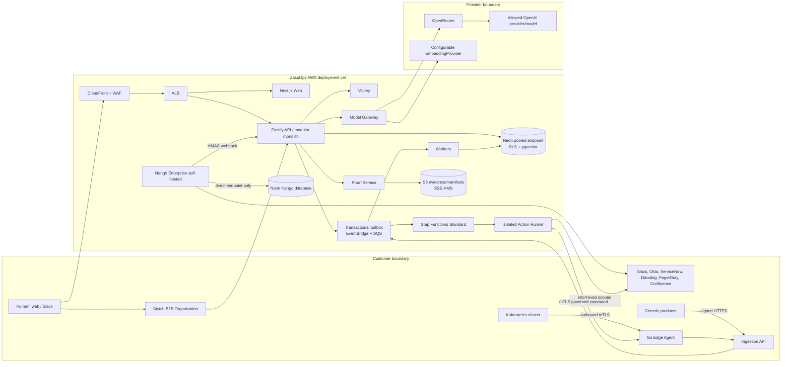
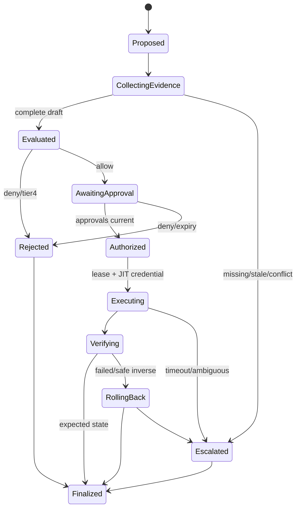

# ZaspOps Technical Implementation Plan

## 1. Purpose, scope, staging, and assumptions

Build ZaspOps as a multi-tenant enterprise context, identity, policy, evidence, and governed-action platform. It layers over systems of record rather than replacing them. Its first release lets authorized operators investigate infrastructure blast radius and request, approve, provision, verify, expire, and revoke time-bound Okta access with a reconstructable decision trail.

**P0 / MVP-1:** temporal Enterprise Context Layer; universal Actor/Resource/Capability/Entitlement/Activity/Work/Policy/Evidence contracts; source provenance/authority/freshness/conflicts; Stytch SSO/SCIM/RBAC; Slack-bound operator questions and approvals; web investigation; launch integrations (Slack, Okta, ServiceNow, Kubernetes, Datadog, PagerDuty, Confluence); generic ingest API; evidence-bound Ask; deterministic policy/risk; Proof Records; and allowlisted ticket/notify/change-draft/Okta group actions.

**P1 / MVP-2:** curated Slack self-service with enriched ITSM escalation; incident enrichment and guided diagnosis; non-production Kubernetes diagnostics and one approved reversible action; expanded administration/quality dashboard; PDF exports, GitHub/AWS context, and policy-scoped MCP/public APIs only after their gates pass.

**Non-goals:** ITSM/IAM/observability replacement; broad workflow builder/marketplace; unrestricted natural-language production execution; Tier 4 execution; direct graph editing; Kubernetes through Nango; human sessions as workload identities; cross-tenant retrieval; and OpenRouter/OpenAI/Stytch PHI processing before approved BAA/technical gates.

**Safe defaults.** Use one AWS region per deployment cell, default `us-west-2` absent residency requirements. Use database-per-environment; standard tier is shared schema with immutable `tenant_id` and forced RLS. Offer a future dedicated Neon project/KMS/VPC/deployment cell only after commercial and capacity approval. PrivateLink is same-region and capped at 10 configurations per AWS Region. [Neon private networking](https://neon.com/docs/guides/neon-private-networking) All targets below are recommended targets, not claimed achievements. SOC 2 and HIPAA readiness are control programs, not certification or compliance claims. [AICPA SOC suite](https://www.aicpa-cima.com/resources/landing/system-and-organization-controls-soc-suite-of-services) [HHS HIPAA Security Rule](https://www.hhs.gov/hipaa/for-professionals/security/laws-regulations/index.html)

## 2. Architecture principles and end-to-end topology

1. Context before action, Proof before approval, verification before completion. Fail closed on missing evidence, source quality, authorization, policy, approval, target, credential, or verification.
2. Preserve source records; normalize without overwrite; select canonical fields through configured authority while retaining conflicts.
3. Human sessions authenticate humans only. Workloads use separately registered, scoped identities.
4. LLMs may extract/summarize/propose; deterministic policy and tool authorization remain outside models.
5. Keep a modular monolith with independently deployed web/API/worker/action-runner/model-gateway/edge components; do not prematurely split microservices.
6. Version OpenAPI, AsyncAPI, JSON Schema, schemas, manifests, prompts, models, policy bundles, and migrations. Use transactional outbox and idempotency throughout.
7. Minimize privilege/data. Enforce tenant and field filtering before retrieval/model prompts; use JIT action credentials and outbound egress allowlists.



**Trust boundaries.** Browser/Slack: TLS, WAF, CSRF for browser mutations, Slack signature validation, session validation, no tenant supplied by client. SaaS/Nango: per-tenant connection IDs, least privilege, HMAC/replay checks, raw-payload quarantine. Cluster: outbound-only mTLS, per-cluster identity, no inbound exposure. DB: `verify-full` TLS, pooled endpoint for product traffic, direct endpoint for migrations/Nango only. Neon poolers are transaction mode and do not support session `SET`; production requires a real-Neon test of transaction-local tenant context. [Neon pooling](https://neon.com/docs/connect/connection-pooling) Model boundary: gateway-only access, classification-based privacy router, redaction and allowlists. Action boundary: action definition + tenant + resolved target + policy/proof hash + idempotency key, then JIT credential. Admin boundary: isolated JIT break-glass with dual approval/audit; it never bypasses action policy/Proof Records.

## 3. Technology decision table

| Area | Selection | Rejected/deferred | Rationale and constraint |
|---|---|---|---|
| Stack | TypeScript `pnpm`/Turborepo; Next.js; Fastify; Node workers | NestJS; multiple control-plane languages | Fastify makes JSON Schema/OpenAPI and explicit dependencies direct; one language minimizes contract drift. |
| Edge | Go binary + Helm chart | Nango/Node/inbound controller | Small static Kubernetes client; outbound-only inventory/events/governed actions. |
| Human identity | Stytch B2B Organizations, SAML/OIDC, SCIM, sessions, RBAC | custom auth/human API keys | Connections are organization-scoped; SCIM deactivation revokes roles/sessions. [Stytch SSO](https://stytch.com/docs/b2b/guides/sso/overview) [Stytch SCIM](https://stytch.com/docs/b2b/guides/scim/overview) |
| Database | Neon Postgres + pgvector | native graph DB/separate vector DB | Keeps transactional graph, RLS, audit, and vectors consistent. HNSW `vector` limit is 2,000 dimensions. [Neon pgvector](https://neon.com/docs/extensions/pgvector) |
| DB endpoints | pooled app endpoint; separately budgeted **direct** Nango endpoint; direct migrations | one connection path | Neon pooling is transaction mode; Nango rejects transaction-mode poolers. [Neon pooling](https://neon.com/docs/connect/connection-pooling) [Nango self-hosting](https://nango.dev/docs/guides/platform/self-hosting.md) |
| ORM/migrations | Drizzle + reviewed SQL `node-pg-migrate` | Prisma/schema push | Typed access but explicit RLS/recursive CTE/vector/transaction control. |
| SaaS integration | self-hosted Nango Enterprise on ECS | free Nango/custom OAuth per provider | Functions/webhooks/OTel/RBAC needed here are Enterprise-only; Nango needs explicit Postgres/S3/OpenSearch/Redis and autoscaling. [Nango self-hosting](https://nango.dev/docs/guides/platform/self-hosting.md) |
| LLM | Model Gateway → OpenRouter, pinned OpenAI default, allowlisted fallbacks | direct module/provider access/auto routing | OpenAI-compatible but validate all schema output; mid-stream failures cannot provider-failover. [OpenRouter structured outputs](https://openrouter.ai/docs/features/structured-outputs) [OpenRouter errors](https://openrouter.ai/docs/api-reference/errors) |
| Embeddings | configurable `EmbeddingProvider`; pgvector storage | claiming OpenRouter embeddings | Evidence does not verify OpenRouter embeddings; persist model/version/dimensions. |
| Policy | OPA/Rego compiled bundles | LLM/application-only policy | Deterministic, versioned inputs/outputs; policy is separate from model reasoning. |
| Runtime | AWS ECS Fargate | EKS control plane | Fargate tasks have separate isolation boundaries; EKS deferred until required. [AWS Fargate](https://docs.aws.amazon.com/AmazonECS/latest/developerguide/AWS_Fargate.html) |
| Ingress | CloudFront + WAF + ALB; API Gateway later for public API | API Gateway everywhere | ALB supports ECS/streaming; WAF protects ALB-routed ECS. [AWS WAF](https://docs.aws.amazon.com/waf/latest/developerguide/waf-chapter.html) |
| Durable work | SQS + EventBridge + Step Functions Standard | synchronous chains/cron-only | outbox durability, worker fan-out, and approval lifecycle; design below the Standard 25,000-event cap. [Step Functions quotas](https://docs.aws.amazon.com/step-functions/latest/dg/service-quotas.html) |
| IaC/SDLC | OpenTofu, Docker Compose, LocalStack, GitHub Actions, Syft/Trivy/Cosign | click-ops | LocalStack helps but real AWS fidelity tests are mandatory. [LocalStack services](https://docs.localstack.cloud/aws/services/) |

### Dependency and version policy

At bootstrap, select maintained LTS/stable releases. Pin exact Node, Go, pnpm, package, container-image, and OpenTofu/Terraform provider versions in repository configuration, lockfiles, and image digests; ban floating tags such as `latest`. Automate patch-update pull requests with test gates. Require an ADR plus compatibility and migration test before any major runtime, package, image, database-extension, IaC-provider, or contract upgrade. Do not invent or imply current version numbers; record each approved version and upgrade decision in the repository.

## 4. Monorepo and ownership boundaries

```text
zaspops/
  apps/{web,api,worker,action-runner,model-gateway,edge-agent}/
  packages/{contracts,db,domain-core,ingest,connectors,policy,proof,actions,authz,retrieval,observability,ui-kit,testkit}/
  infra/{tofu/modules,tofu/envs/{dev,staging,prod},docker}/
  docs/adr/  scripts/
```

`api` orchestrates but cannot call targets. `action-runner` alone invokes target systems. `model-gateway` alone calls models/providers. `ingest` owns source normalization/provenance; connectors never write canonical tables directly. `domain-core` owns canonical projection/resolution/quality; `proof` accepts only validated versioned decision inputs. Changes to `contracts` require compatibility check/version bump.

## 5. Components, APIs, jobs, events, degradation

| Component | Deployable role | Degraded behavior |
|---|---|---|
| web | Next.js operator/admin console | cached shell/status; mutations unavailable visibly |
| api | Fastify OpenAPI/webhooks/commands | persist retry-safe command; read-only if runner impaired |
| worker | ingestion/resolution/indexing/quality/retention | visible backlog/staleness; no silent completeness |
| action-runner | isolated write adapters | paused kill switch; no direct retry outside state machine |
| model-gateway | retrieval/model route/validation/budget | evidence-only answer; never model-derived write proposal |
| Nango | OAuth/sync/action/webhook infrastructure | connector degraded/reconcile; other connectors remain live |
| edge-agent | customer cluster inventory/events/actions | bounded encrypted spool; rejects expired command |

API groups: `/v1/auth`, `/v1/context`, `/v1/work`, `/v1/approvals`, `/v1/actions` (preview/status only), `/v1/admin`, `/v1/ingest`, `/v1/proof`, and signed raw-body `/webhooks/{slack,nango,stytch}`. Generate OpenAPI 3.1 and AsyncAPI 3.0. Every event has `event_id,event_type,schema_version,tenant_id,occurred_at,producer,correlation_id,causation_id,payload_ref`; payloads beyond safe queue size use hashed S3 references. SQS has a 1 MiB message limit. [SQS quotas](https://docs.aws.amazon.com/AWSSimpleQueueService/latest/SQSDeveloperGuide/quotas-messages.html)

Core events/consumers: `source.record.received` → normalizer; `context.observation.recorded` → resolver; `context.entity.changed` → graph/index/quality; `work.created` → proof/policy; `approval.requested` → Slack/web; `action.authorized` → state machine; `action.executed` → verifier/proof; `entitlement.expiry.due` → revoker; `connector.reconcile.due` → checkpoint poller; `retention.enforce.due` → legal-hold-aware purger. Schedule minute-level timeout scans, 5-minute connector freshness/reconcile, hourly expirations/retries, daily quality/index/key-aging, weekly backup sampling, and monthly access/control exports.

## 6. Multi-tenant identity and authorization

Create immutable internal `tenant_id UUIDv7` at provisioning and bind it uniquely to `stytch_organization_id`; do not reuse vendor IDs as universal keys. Create immutable `actor_id UUIDv7` for people, teams, services, agents, runtimes, and workload identities. `actors.external_subject` is unique per `(tenant_id,issuer,subject)`; aliases are temporal records. Valid Stytch session → org/member → active Person Actor. Recheck lifecycle and tenant membership each request. SCIM lifecycle/webhooks update membership; because role changes may reach active JWTs within five minutes, high-risk operations must check the internal current membership and reject revoked actors immediately. [Stytch SCIM](https://stytch.com/docs/b2b/guides/scim/overview)

Stytch performs organization membership, SSO/MFA/session posture, and coarse roles. Map Stytch role IDs to internal `operator,approver,connector_admin,policy_admin,auditor,tenant_admin,breakglass`; keep app permissions in ZaspOps because Stytch reserves `stytch.*` resources. [Stytch RBAC](https://stytch.com/docs/b2b/guides/rbac/overview) Invocation authorization is: tenant/status → RBAC resource/action → ABAC (environment, classification, owner, target/customer scope, source authority/freshness, delegation, risk/time/budget) → OPA decision → RLS query → Proof requirement.

Delegation is a time-valid edge with delegator/delegate, capability/target selector, max risk, data class, budget, expiry, and revocation. Intersect permissions/limits; never union. Agent execution records accountable Agent and runtime/workload identity. Human sessions never authenticate work. ECS task roles, edge mTLS certificates, Nango service identity, and agent runtime credentials register in `workload_identities` with environment, scope, expiry, rotation, and status.

Slack user IDs are aliases, not authorization. First sensitive operation creates one-time state-bound web link; after Stytch auth store verified `(tenant_id,slack_team_id,slack_user_id)->actor_id`. Require active workspace install + active actor. Rebind only with confirmation/audit; reject workspace collisions.

**RLS roles:** `zaspops_migrator` owns schema/direct endpoint; `zaspops_app` is non-owner/no `BYPASSRLS`; `zaspops_nango` is limited to Nango DB/schema; `zaspops_audit_writer` is append-only; `zaspops_breakglass_reader` is JIT read-only. Table owners and `BYPASSRLS` bypass RLS by default, so force RLS on every tenant table. [PostgreSQL RLS](https://www.postgresql.org/docs/current/ddl-rowsecurity.html)

```sql
ALTER TABLE entities ENABLE ROW LEVEL SECURITY;
ALTER TABLE entities FORCE ROW LEVEL SECURITY;
REVOKE ALL ON entities FROM PUBLIC;
GRANT SELECT, INSERT, UPDATE, DELETE ON entities TO zaspops_app;
CREATE POLICY tenant_guard ON entities AS RESTRICTIVE FOR ALL TO zaspops_app
 USING (current_setting('app.tenant_id', true) IS NOT NULL)
 WITH CHECK (current_setting('app.tenant_id', true) IS NOT NULL);
CREATE POLICY tenant_rows ON entities FOR ALL TO zaspops_app
 USING (tenant_id=current_setting('app.tenant_id',true)::uuid)
 WITH CHECK (tenant_id=current_setting('app.tenant_id',true)::uuid);
```

Implement `app.set_tenant_context(uuid,uuid,text)` using transaction-local `set_config(...,true)` and call it only within an explicit transaction wrapper. The evidence does not verify this combination with Neon transaction pooling: block pooled production rollout on real-Neon `rls_pooler_context_test`. If it fails, use signed tenant capability input to rigorously validated `SECURITY DEFINER` access functions; never fall back to session `SET`. Use tenant-composite PKs/FKs/unique constraints because integrity checks bypass RLS and can leak cross-tenant existence. [PostgreSQL RLS](https://www.postgresql.org/docs/current/ddl-rowsecurity.html)

Break-glass: isolated Stytch break-glass Organization, named incident/reason, security + on-call dual approval, MFA, JIT max 60 minutes, explicit tenant/object scope, no auto-approval/bypass, auto-expiry, tenant notification, and next-business-day review. The Stytch `is_breakglass` flag is auditable but is not permission to bypass platform controls. [Stytch Organization](https://stytch.com/docs/b2b/api/organization-object)

## 7. Postgres schema, temporal graph, and resolution

All tenant tables carry `tenant_id`, UUIDv7 IDs, timestamps, RLS, and composite tenant keys. Secrets stay in Secrets Manager/Nango, not domain tables.

| Area | Tables and key constraints |
|---|---|
| tenants/actors | `tenants(tenant_id PK,stytch_organization_id UNIQUE,region,tier,state)`; `actors(tenant_id,actor_id PK,actor_type,lifecycle_state,accountable_owner_actor_id,external_issuer,external_subject,UNIQUE(tenant_id,external_issuer,external_subject))`; `actor_aliases`, `memberships`, `role_bindings`, `delegations`, `workload_identities`, `slack_bindings` with active partial uniques. |
| schema/packs | `schema_registry(namespace,version UNIQUE,core_type,json_schema,compatibility,hash,state)`; `domain_packs(publisher,version,manifest_hash,signature,state)`; `tenant_pack_installations(tenant_id,pack_id,version,grants,state)`. |
| sources | `connectors`; `connector_checkpoints(tenant_id,connector_id,stream,cursor,last_success_at,UNIQUE(...))`; `source_records(tenant_id,source_record_id PK,connector_id,source_type,external_id,revision,observed_at,received_at,content_hash,payload_ref,deleted_at,UNIQUE(tenant_id,connector_id,source_type,external_id,revision))`; `ingest_inbox(provider,delivery_id UNIQUE,received_hash,status)`. |
| graph | `entities(tenant_id,entity_id PK,core_type,domain_type,canonical_name,lifecycle_state)`; append-only `observations(attribute_path,value_json,value_hash,source_record_id,authority,confidence,certification_state,observed_at,ingested_at,valid_range,superseded_at)`; `relationships(from_entity_id,to_entity_id,relationship_type,source_record_id,authority,confidence,valid_range,state)`. Index active from/to relationship paths and GiST range. |
| retrieval | `documents(entity_id,source_record_id,title,body_ref,classification,authority,freshness_at,valid_range,tsv)`; `document_chunks(document_id,ordinal,text,text_hash,token_count,embedding_model,embedding vector(n),valid_range)` with GIN and active/model/tenant partial HNSW. |
| policy/work/action | `policies`; `policy_decisions(bundle_hash,input_hash,output_json,result)`; `work_items(kind,status,requester_actor_id,target_ref,risk_tier,idempotency_key,UNIQUE(tenant_id,kind,idempotency_key))`; `action_definitions`, `action_proposals`, `approvals`, `action_executions`, `verification_results`, `rollback_attempts`. |
| proof/audit | `proof_records(work_id UNIQUE,canonical_json,canonical_hash UNIQUE,prior_proof_id,finalized_at)`; `proof_manifests`, `proof_amendments`, append-only `proof_events`; monthly-partitioned `audit_events`; `outbox_events`, `idempotency_keys`, `retention_holds`, `export_jobs`. |

Monthly partition `source_records,observations,audit_events,proof_events,outbox_events`; precreate three months. Index hot data `(tenant_id,time DESC)` and cold time with BRIN. `observed_at` is source time, `received_at/ingested_at` ZaspOps time, and `valid_range=[from,to)`. Do not mutate historical observations/edges: deletions close validity with tombstone/revision. Canonical views select current valid values by authority, certification, freshness, and deterministic tie breaker; conflicts remain visible.

Postgres is not a graph database. Use bounded recursive CTEs with tenant predicate in anchor/recursive terms, max depth 6, max 2,000 nodes, 2-second statement timeout, allowed relationship types, cycle detection, and cursor pagination. Precompute common Tier-1 topology snapshots. Entity resolution uses source immutable keys first (Kubernetes UID; Okta/ServiceNow/PagerDuty/Datadog IDs; Slack team/user); then exact normalized aliases; then type-compatible scored candidates (name/owner/namespace/account/evidence overlap). Auto-merge only above a high configured threshold with no authoritative conflict. Otherwise make review candidate. Merges change canonical pointers/aliases and are reversible, never destructive.

## 8. Ingestion architecture and connector contract

Nango owns OAuth connection UX/token refresh/provider sync/action execution/webhook forwarding. Its backing database/schema is physically and logically separate from ZaspOps domain schemas, uses the dedicated `zaspops_nango` role and direct-Neon connection budget, and never contains or shares ZaspOps RLS tenant tables. ZaspOps owns manifests, field filtering, source authority, raw payload references, normalization, schema validation, provenance, resolution, canonicalization, quality/retention, action policy, and Proof Records. Verify `X-Nango-Hmac-Sha256`; Nango retries only twice, so write durable inbox/idempotency and poll checkpoints for reconciliation. [Nango webhooks](https://nango.dev/docs/guides/platform/webhooks-from-nango.md) Use Nango Enterprise only; free self-hosting lacks required Functions/Webhooks/OTel/RBAC/SLA. [Nango self-hosting](https://nango.dev/docs/guides/platform/self-hosting.md) Its cache prunes/hard-deletes inactive records, so it is never the evidence system of record. [Nango limits](https://nango.dev/docs/guides/platform/limits.md)

Every signed versioned connector manifest declares provider, capability/scopes, mappings, external ID/deletion strategy, webhook validation, cadence, authority per field/edge, data classes/filters, freshness target, rate/concurrency, retries, write action definitions, and fixtures. Reject write activation without an action verification/rollback-or-escalation plan. Normalized envelope includes schema version, tenant/connector, source kind/external ID/revision/observed time, record type, upsert/delete, payload/hash, authority, classification, correlation ID.

Persist webhook/generic delivery into `ingest_inbox` transactionally; acknowledge after durable write. Queue normalization. Advance checkpoint only after normalized commit. Replay by cursor/snapshot to a new ingest run; never overwrite source record. Deletes tombstone/close fact/edge validity while retaining provenance. Health states: `healthy,degraded,stale,auth_required,schema_failed,paused,revoked`; show lag, latest source event, last success, authority classes, and affected workflows. Token-bucket per tenant/provider in Valkey, per-connector concurrency, jitter retry only classified transient failures, DLQ/replay, S3 indirection for large payloads.

Nango owns encrypted SaaS OAuth credentials; separate read/action connections. Its encryption key cannot rotate, so record an approved compensating-control exception (access restriction, immutable key version, emergency redeploy/reconnect runbook) and forbid PHI credentials until security accepts it. [Nango self-hosting](https://nango.dev/docs/guides/platform/self-hosting.md)

**Kubernetes edge.** Helm creates namespace, split read/action ClusterRoles, service account, network policy/config, signed image. Bootstrap one-time token exchanges for short mTLS certificate. Agent uses `resourceVersion`/bookmarks, monotonic batch sequence, bounded encrypted disk spool. Command includes action ID, target UID/resourceVersion, proof/policy hash, nonce, signature, expiry; agent validates all and executes only registered kinds. Generic API accepts mTLS/HMAC workload identities, requires schema registration/provenance, enforces payload/rate, and returns replay acknowledgment.

## 9. Retrieval and AI orchestration

Pipeline: (1) resolve tenant/Actor/RBAC+ABAC/classification/named entities; (2) retrieve structured graph facts under RLS; (3) lexical `tsvector` chunks with tenant/classification/entity/source/authority/freshness filters; (4) vector candidates with identical filters; (5) reciprocal-rank fuse/deduplicate/re-rank by authority/certification/freshness/directness; (6) make EvidencePacket containing fact/edge/observation/source IDs, field, times, quality, redaction; (7) model emits typed claims citing packet IDs; (8) validate JSON Schema/citations/claim support/scopes; remove unsupported facts or label inference, else return evidence-only/escalation. pgvector supports partial indexing/partitioning for filtered ANN. [Neon pgvector](https://neon.com/docs/extensions/pgvector)

`EmbeddingProvider` contract has `providerId,modelId,dimensions` and `embed({tenantId,texts,classification})`. Chunk 400–800 tokens/80 overlap with source heading/entity/revision/hash/classification/validity. Never embed secrets; omit/redact Restricted free text. Persist model/version/dimension; reindex on change. Provider selection is a procurement/security gate and dimension must match selected pgvector index. Do not claim OpenRouter embedding support.

Only Model Gateway exposes `generate/embed`; lint-ban provider SDKs elsewhere. Version prompt/output schema/retrieval/tool/policy/model/provider/evaluation. Default OpenRouter request uses explicit OpenAI model/provider allowlist, `data_collection: deny`, `zdr:true`, `require_parameters:true` for schema-critical calls, max tokens, maximum 5 tool turns. This does not create a BAA/HIPAA conclusion: OpenAI retention is unknown and OpenRouter/OpenAI BAA is unverified. [OpenRouter privacy](https://openrouter.ai/docs/features/privacy-and-logging) [OpenRouter routing](https://openrouter.ai/docs/features/provider-routing) Privacy router: Public/Internal approved default; Confidential tenant-approved route; Restricted/ePHI is no-model until provider BAA/retention/residency/DPA/security/redaction gates are documented. Retry pre-stream 429/503 with `Retry-After`; restart from evidence after mid-stream error because it cannot fail over. [OpenRouter errors](https://openrouter.ai/docs/api-reference/errors)

Tool calls are candidates, not authority. Reauthorize tool at every invocation, send tool schema each sequence turn, validate args, cap parallelism/loops/cost/time, and bind calls to policy/proof. [OpenRouter tool calling](https://openrouter.ai/docs/guides/features/tool-calling.md) Cache only redacted tenant/actor-scope read answers keyed by source/freshness/policy version; never cache actions/approvals. Treat retrieved connector text as untrusted data: delimit, never let it alter system instructions/tool scopes/policy/model routing/egress. Evaluate citations, unsupported claims, retrieval, injection, refusal, tool safety, latency/token/cost and outages with versioned sanitized fixtures/red-team corpus; promotion requires safety non-regression.

## 10. Deterministic policy and governed actions

OPA input: tenant/actor/workload/delegation, resource/target, classification, freshness/authority/conflicts, action version, environment, blast-radius, time, approvals, limits. Output: `allow,risk_tier,reasons,required_evidence,required_approvals,constraints,credential_scope,verification_required,rollback_required,policy_bundle_hash`. Deny malformed/unknown inputs. Signed approved bundle only; record exact input/output hashes. Tiers: 0 read/inform; 1 narrow reversible; 2 controlled access; 3 elevated/multi-approval; 4 recommendation-only. MVP-1 allowlists only Tier 1–2.



Command transaction creates work, proof draft, policy decision, and outbox event together. Step Functions Standard orchestrates approvals/timeouts/retries but stores IDs/hashes only; workers summarize long poll loops below Standard history cap. [Step Functions quotas](https://docs.aws.amazon.com/step-functions/latest/dg/service-quotas.html) Action lease is unique `(tenant_id,action_definition_id,idempotency_key)`. Runner re-resolves target UID/version, obtains scoped short-lived credential, logs fingerprint not secret, invokes one upstream idempotency token, and verifies authoritative target state. HTTP success alone is insufficient. Rollback is separately policy-checked inverse action with recorded pre-state. No safe rollback means named escalation and no auto-execution.

## 11. Immutable Proof Records

A Proof Record is a historical decision snapshot. Draft can change; finalized never changes. `proof.v1` contains requester/approver/accountable/executing identities and delegation; targets/resolved versions; source IDs/revisions/hashes/times; fact/edge IDs; authority/freshness/conflicts; connector/schema/pack/policy/action/workflow/prompt/model/provider versions; policy hashes; approvals; action/verification/rollback plan/results.

Canonicalize deterministic UTF-8 JSON with lexicographic keys, normalized number/timestamp forms, semantic array order, no insignificant whitespace; SHA-256 it. In serializable transaction store canonical JSON/digest, manifest rows, append event, and `proof.finalized` outbox. Deny proof UPDATE/DELETE with trigger/least-privilege role; append through guarded function. Maintain tenant hash chain and periodic signed Merkle root. Copy canonical object/manifest to tenant S3 SSE-KMS/versioned prefix; S3 calls require TLS/SigV4 and specified KMS key. [S3 SSE-KMS](https://docs.aws.amazon.com/AmazonS3/latest/userguide/UsingKMSEncryption.html) Offer Object Lock/WORM only after IaC verification/security decision because the evidence does not verify its behavior. S3 failure blocks write-action finalization, not clearly labeled draft reads.

Corrections create linked amendment with original hash, correction source/author/time/new hash; never rewrite old proof. JSON/console is P0; human PDF P1. `pnpm proof:verify --proof ID --tenant ID` recomputes canonical/source hashes, walks hash chain, validates Merkle signature and S3 version/metadata, and reports mismatch.

## 12. Workflow mappings and failure states

| Workflow | Backend sequence | Fail-safe state |
|---|---|---|
| investigation/blast radius | `POST /context/investigations` → authz → entity resolve → graph/hybrid retrieval → quality → gateway → draft proof → console/Slack; ticket/notify/change becomes action proposal | ambiguity selector; stale/missing/conflict named; write disabled; model outage returns evidence-only |
| time-bound Okta access | work command → entitlement map → policy/proof → approval event/card → state machine → runner provision → verify → expiry revoke/verify → finalize | unbound Slack requires Stytch; no approver fallback queue; no false success on verification error |
| Slack approval | signed event → inbox → resolve binding/current actor → concise proof → signed approve/deny → event | reject stale binding/session, changed policy/hash, expired/duplicate approval |
| connector admin | admin manifest → Nango/edge bootstrap → scope validation → baseline sync → health dashboard | `auth_required/schema_failed/stale`; no credential display; scoped workflow degradation |
| certification | owner action → role/policy → temporal certification observation → projection/quality | stale/deleted source flags review; no silent retention |
| MVP-2 self-service | Slack → identity/context → bounded clarification → certified answer/safe action or ServiceNow handoff | insufficient context is named; human escalation always available |
| MVP-2 incident | PD/SN/DD event → work → resolver/change/topology → evidence summary/diagnostics → optional action | inferred causes labeled; inference alone cannot enable writes |

## 13. AWS environments, network, secrets, and developer setup

Use separate AWS accounts for `prod`, `staging`, `security-log`, and `backup`; dev is non-production. Each app account has three-AZ VPC: public ALB/NAT only, private ECS services, VPC endpoints where possible. CloudFront → WAF → ALB routes web/API/webhooks. ECS tasks have no public IP and separate task roles/security groups. Egress is DNS/SG/HTTP allowlisted to Stytch, OpenRouter, target SaaS, telemetry, and Neon PrivateLink. Route 53 supplies DNS/health checks.

Use in-region Neon PrivateLink where approved; block public Neon only after tested private path. Require `verify-full` TLS. Neon has up to 30-day PITR on Scale and 30-day backup retention, so export Proof/audit artifacts to S3 for longer evidence retention. [Neon security](https://neon.com/docs/security/security-overview) [Neon PITR](https://neon.com/docs/introduction/point-in-time-restore) Deploy Nango as separate ECS Server/Orchestrator/Jobs/Runner/Persist plus OpenSearch/Valkey/S3 and a physically and logically separate Nango backing database/schema. It uses the `zaspops_nango` role and its own direct-Neon connection budget; it never shares ZaspOps domain schemas or RLS tenant tables. Alarm its direct connection budget and runner latency. Nango does not supply automatic scaling. [Nango self-hosting](https://nango.dev/docs/guides/platform/self-hosting.md)

KMS CMKs are per environment/data class; Secrets Manager holds DB/provider/API/bootstrap references with rotation where supported. S3 buckets: raw payload, evidence, export, app log, CloudTrail, backup. Require SSE-KMS, versioning, public block, lifecycle/retention, tenant prefix/tag grants. Organization multi-region CloudTrail writes to locked logging account; enable data events explicitly because default trails log management, not data events. [CloudTrail](https://docs.aws.amazon.com/awscloudtrail/latest/userguide/cloudtrail-concepts.html) Enable Config recording/aggregator before Security Hub and explicitly enable GuardDuty Runtime Monitoring for ECS/Fargate. [Security Hub](https://docs.aws.amazon.com/securityhub/latest/userguide/what-is-securityhub.html) [GuardDuty](https://docs.aws.amazon.com/guardduty/latest/ug/what-is-guardduty.html)

Local Compose runs Postgres+pgvector, Valkey, LocalStack, OpenSearch, Nango, OTel Collector, Mailpit, and mocks. LocalStack is useful, not fidelity proof: require ephemeral real AWS tests for IAM/KMS/CloudTrail/Step Functions/WAF/ECS/PrivateLink. [LocalStack capabilities](https://docs.localstack.cloud/aws/capabilities/)

```bash
corepack enable && pnpm install
cp .env.example .env.local
pnpm infra:local:up && pnpm db:migrate && pnpm db:seed
pnpm dev
pnpm test && pnpm test:integration:localstack && pnpm rls:test
pnpm test:aws:ephemeral
```

Inventory only (never values): `NODE_ENV,APP_BASE_URL,AWS_REGION,DATABASE_POOL_URL,DATABASE_DIRECT_URL,NANGO_DATABASE_DIRECT_URL,STYTCH_PROJECT_ID,STYTCH_SECRET_ENV_REF,OPENROUTER_API_KEY_REF,MODEL_ROUTE_CONFIG_REF,EMBEDDING_PROVIDER_CONFIG_REF,S3_EVIDENCE_BUCKET,KMS_KEY_ARN,SQS_*_URL,EVENT_BUS_NAME,OTEL_EXPORTER_OTLP_ENDPOINT,NANGO_BASE_URL,NANGO_WEBHOOK_SIGNING_KEY_REF,SLACK_SIGNING_SECRET_REF,EDGE_CA_KEY_REF,FEATURE_FLAG_CONFIG_REF`. AWS injects Secret references/values; never commit `.env`, connection strings, tokens, or keys.

## 14. SLOs, capacity, backup, DR, and runbooks

| SLI | Recommended target/error budget | Degraded behavior |
|---|---|---|
| valid API acknowledgement | 99.9% monthly under 1 s / 43.2 min | durable command/inbox then async status |
| common evidence answer | p95 under 10 s where sources available | progressive/evidence-only result, explicit gaps |
| graph lookup | p95 under 500 ms | bounded/cached query or reject expensive traversal |
| Proof initial render | p95 under 5 s | known evidence first, progressive completion |
| action status | p95 within 2 s of source response | pending/reconcile, never premature success |
| tenant isolation or action proof/policy/verification omission | 0 tolerated | containment/global writes kill switch |

### Recommended initial capacity validation envelope

This is a **validation target, not a capacity claim**. Before enabling write actions broadly, load-test a deployment cell for 10 tenants; up to 250 active operator users per tenant; 10 million canonical entities total; 100 million active/historical observations plus edges; 100 source events/second sustained and 500/second burst; 50 concurrent investigations; and 20 governed actions/minute platform-wide. Test steady state, burst, backfill/replay, connector outage, vector-query, approval, and action-verification mixes while measuring each SLI, queue age, direct/pool connection use, storage/index growth, provider cost, and tenant fairness. Revise this envelope using design-partner telemetry before each release gate.

Autoscale API/web on CPU/memory/requests; workers on SQS oldest age/depth/Neon pool wait; action runner with per-tenant/action concurrency; Nango runners on latency/execution queue. Load test 10× launch peak and enforce hard admission limits. Fargate tasks must use documented CPU/memory combinations. [ECS task definition](https://docs.aws.amazon.com/AmazonECS/latest/developerguide/task_definition_parameters.html)

### Recommended initial disaster-recovery targets

These are **recommended design targets, not achieved commitments**: single-service redeploy RTO 60 minutes; primary-region database recovery RPO 5 minutes and RTO 4 hours; regional backup/restore RPO 15 minutes and RTO 8 hours. A Proof Record is acknowledged as finalized only after the same finalization boundary has durably committed to Postgres **and** S3; measure and alert on cross-region evidence-copy lag separately. Contractual availability above these targets requires a warm-standby design, tested promotion/failover, and explicitly funded capacity.

Use Neon PITR/branch restores; scheduled encrypted metadata/proof-index exports through direct endpoint; S3 versioned evidence; AWS Backup Vault Lock/cross-account copy for AWS-managed resources. AWS Backup does not cover Neon. [AWS Backup](https://docs.aws.amazon.com/aws-backup/latest/devguide/whatisbackup.html) Start infrastructure DR at backup/restore and set customer-specific tested RTO/RPO; move to warm standby only for contractual need. Quarterly tabletop and semiannual restore: isolated account restore, Proof hash verification, RLS tests, elapsed RTO/RPO record/corrective action.

Runbooks: model outage (evidence-only); Neon outage (block reads/writes with banner); queue backlog (throttle ingest/preserve actions); Nango outage (stale/reconcile); credential compromise (disable/rotate/reconnect); action timeout/ambiguity (hold/reconcile/escalate); suspected isolation breach (global containment); regional recovery. Feature flags per tenant/connector/workflow/action/model/pack and global `writes_disabled,model_disabled,edge_actions_disabled,pack_disabled`, all default fail closed. Migrations are expand/contract; rollback is image/IaC version or forward corrective migration, never blind DB reversal.

## 15. OpenTelemetry, dashboards, and audit separation

Instrument all processes with OTel traces/metrics/structured logs. Use collector sidecars/gateway for batching/retry/encryption/redaction; OTLP HTTP is 4318. [OpenTelemetry Collector](https://opentelemetry.io/docs/collector/) [OTLP specification](https://opentelemetry.io/docs/specs/otlp/) Send Nango traces to same gateway; evidence only verifies Nango trace, not metrics/log export. [Nango OTel](https://nango.dev/docs/guides/platform/observability.md)

Attributes: environment/region/version/service, tenant hash (not raw tenant ID in shared views), connector/action/policy/model/prompt version, correlation/work/proof/message IDs, source, classification. Redact headers/cookies/tokens, prompts, raw payloads, identifiers, secrets, PHI before telemetry. Raw forensic material remains tenant S3 with access audit.

Dashboards/alerts: API RED; worker queue age/DLQ; connector freshness/authority; graph resolution/conflicts; retrieval/citations/unsupported claims; provider/model latency/error/fallback/token/cost; policy denials; approvals; action verification/rollback; DB pools/RLS; Nango; proof/hash; CloudTrail/Config/GuardDuty/Security Hub. Alert on SLO burn, RLS anomaly, proof mismatch, write event gap, action ambiguity, stale connector, credential age, provider budget/outage, DLQ, restore failure, control service disabled, WAF abuse. Keep application `audit_events`/Proof events append-only and access-separated from operational logs; mirror material auth events because Stytch logs retain only 30 days and only stream to Datadog/Grafana Loki. [Stytch event logs](https://stytch.com/docs/resources/workspace-management/event-logs)

## 16. Comprehensive test strategy

Unit: TypeScript/Go logic, canonicalization, quality, resolution, policy input, redaction/idempotency. Contracts: OpenAPI/AsyncAPI break checks, JSON Schema property tests, manifest/action/pack compatibility. Database: migrations, complete RLS matrix over every tenant table/role/operation, real Neon pooled context, FK/unique side-channel, partition/retention/vector filters. Connector: sanitized recordings, HMAC/replay/out-of-order/deletion, checkpoint replay, rate/auth/schema drift. Graph: 500+ stratified resolution sample, adversarial aliases, temporal edges, cycle/depth, blast radius. AI: citations/unsupported claims/inference/injection/tool/fallback/privacy/budget. Policy/action: Rego coverage/mutation, delegation attenuation, Tier 4 deny, duplicate/timeout/ambiguous target, verification/rollback. E2E: browser/Slack SSO-SCIM, Okta sandbox access, Proof verify/export, connector admin/certification, incident. LocalStack and ephemeral real AWS: queues/S3/secrets/events/workflows plus IAM/KMS/ECS/WAF/CloudTrail/alarms/destruction. Security: ASVS v5 requirement labels, API Top 10, SAST/SCA/secret/image/IaC/DAST/SBOM/signatures/pen-test. [OWASP ASVS](https://owasp.org/www-project-application-security-verification-standard/) [OWASP API Top 10](https://owasp.org/API-Security/editions/2023/en/0x11-t10/) Include WCAG 2.2 AA automated/manual accessibility; load/soak/chaos; migration/backup/restore/DR drills.

CI requires format/lint/typecheck, unit/contracts/migration/RLS/policy/security/SBOM/image signature/local integration/preview smoke. Protected main requires review/green gates/ADR for data identity actions models topology/contracts, and no unexpired critical/high exception.

## 17. Compliance readiness, classification, and retention

| Theme | Controls | Evidence / owner / frequency | Contract gate |
|---|---|---|---|
| SOC 2 Security | SSO/SCIM/RBAC/ABAC/RLS/IAM/WAF/vulnerability management | access/RLS/IAM/scan records; Security monthly/quarterly | Stytch diligence; no HIPAA inference |
| Availability | SLOs/queues/autoscale/backups/IR | SLO/drill/postmortem; SRE weekly/quarterly | Neon plan/PITR decision |
| Processing Integrity | schemas/outbox/idempotency/proof hashes | replay/contract/hash reports; Platform per release | Nango mapping controls |
| Confidentiality/Privacy | class/redaction/encryption/retention/exports | DPA/subprocessor/export/purge logs; Privacy quarterly | vendor terms |
| HIPAA admin/physical/technical safeguards | IDs/MFA/audit/TLS/KMS/RLS/IR/backup | Security/Compliance: risk analysis annually and on material change; access review quarterly; audit review weekly; restore drill semiannual; workforce training annually; incident tabletop quarterly | BAA/data map before ePHI |
| Secure SDLC | signed builds/SBOM/review/scans/vulnerability response | attestations/PR evidence; each build | SSDF PO/PS/PW/RV label [NIST SSDF](https://csrc.nist.gov/Projects/ssdf) |

HIPAA gate: legal business-associate/data-map decision; AWS BAA acceptance and PHI-capable account designation (eligibility remains customer-configured); [AWS Artifact](https://docs.aws.amazon.com/artifact/latest/ug/managingagreements.html) Neon Scale HIPAA project before ePHI—irreversible and exclude Data API/Managed Better Auth; [Neon HIPAA](https://neon.com/docs/security/hipaa) Nango BAA/self-hosted controls approved; [Nango security](https://nango.dev/docs/guides/platform/security.md) Stytch/OpenRouter/OpenAI/observability/support BAA/eligibility reviews complete; model traffic disabled until provider BAA/retention/residency/DPA/redaction gate. HHS requires safeguards/BAAs; architecture is not compliance. [HHS HIPAA Security Rule](https://www.hhs.gov/hipaa/for-professionals/security/laws-regulations/index.html)

| Class | Examples | Rule | Default retention |
|---|---|---|---|
| Public | published docs | normal cache | lifecycle |
| Internal | non-customer metadata | tenant scope | 1 year configurable |
| Confidential | topology/incidents/tickets | encrypt/redacted telemetry/approved model route | 1 year configurable |
| Restricted | identity/entitlements/credentials | no logs/embeddings; secret manager/explicit field policy | minimum necessary |
| ePHI | identifiable health data | approved cell only; no unapproved model/vendor | BAA/legal schedule; compliance documentation minimum six years after later creation/last effective date [HHS](https://www.hhs.gov/hipaa/for-professionals/security/laws-regulations/index.html) |

## 18. STRIDE threat model

| Abuse case | Mitigation | Required test |
|---|---|---|
| cross-tenant retrieval | RLS/composite keys/tenant cache and vector filters/authz-before-retrieval | mutation/property/red-team tenant tests |
| prompt injection | untrusted data delimiting/no retrieved instructions/re-authorized structured tools | injection corpus/no tool-route-policy change |
| malicious connector | schema/size/HMAC/mTLS/quarantine/SSRF controls/rate limits | malformed/replay/SSRF tests |
| confused deputy | delegation attenuation/target+proof+policy bind/JIT scope | target substitution/delegation tests |
| replay | inbox/event/action idempotency/nonces/expiry/DLQ reconcile | duplicate/out-of-order chaos |
| token theft | encryption/scoped read-write separation/egress/no logs/reconnect plan | secret/IAM/compromise tabletop |
| pack supply chain | signatures/SBOM/revocation/capability approval/isolation/kill switch | invalid signature/escalation/rollback |
| unsafe tool call | Gateway only/invocation policy/loop-budget/Tier 4 deny/approval | hallucinated tool/budget/policy bypass |
| audit tampering | append-only/hash chain/Merkle/S3 versions/access separation | modification/hash/restore validation |
| RLS owner/pooler bypass | non-owner/FORCE RLS/real Neon gate | role matrix/pooler test |
| availability abuse | WAF/rate/budgets/backpressure/circuit breakers | load/soak/outage test |

## 19. Dependency-ordered work breakdown

Each row is one focused pull request. The **Verify / evidence** cell is both the objective acceptance criterion and the mandatory completion artifact that must be attached to the PR (command output, report, ADR, artifact digest, or screenshot).

| ID | Priority/phase | Dependencies | Output | Verify / evidence |
|---|---|---|---|---|
| E00/T00.1 | P0 foundation | — | pnpm/Turbo monorepo, Node/Go pin | `pnpm install && pnpm lint` |
| E00/T00.2 | P0 foundation | T00.1 | lint/format/typecheck/hooks | `pnpm format:check && pnpm typecheck` |
| E00/T00.3 | P0 foundation | T00.1 | Compose local dependencies | `pnpm infra:local:up` health log |
| E00/T00.4 | P0 foundation | T00.1 | ADR template + initial decisions | `pnpm docs:adr:check` |
| E00/T00.5 | P0 foundation | T00.1 | OpenAPI/AsyncAPI/JSON Schema generation | `pnpm contract:generate && git diff --exit-code` |
| E00/T00.6 | P0 foundation | T00.1 | CI/protected branch workflow | green sample PR/rule capture |
| E00/T00.7 | P0 foundation | T00.6 | SBOM/image scan/Cosign | `pnpm supplychain:verify` attestation |
| E00/T00.8 | P0 foundation | T00.3 | LocalStack test harness | `pnpm test:integration:localstack` |
| E01/T01.1 | P0 identity | T00.4 | Stytch tenant-provision adapter/mapping | adapter unit tests |
| E01/T01.2 | P0 identity | T01.1 | SSO callback/session validation | mocked SAML/OIDC integration |
| E01/T01.3 | P0 identity | T01.1 | SCIM webhook/lifecycle mapper | deprovision denies actor test |
| E01/T01.4 | P0 identity | T01.2 | actor/alias/membership migration | unique/lifecycle migration test |
| E01/T01.5 | P0 identity | T01.4 | RBAC mapping/middleware | permission matrix report |
| E01/T01.6 | P0 identity | T01.5 | ABAC/delegation evaluator | attenuation property test |
| E01/T01.7 | P0 identity | T01.2 | Slack bind/rebind flow | unbound sensitive command e2e |
| E01/T01.8 | P0 identity | T01.5 | workload IDs/JIT break-glass | human-session workload denial/audit |
| E02/T02.1 | P0 data | T00.4 | Neon roles/endpoints ADR + ToFu | plan/security review |
| E02/T02.2 | P0 data | T02.1 | reviewed SQL migration runner | `pnpm db:migrate:test` |
| E02/T02.3 | P0 data | T02.2 | tenant schema/FORCE RLS baseline | `pnpm rls:test` |
| E02/T02.4 | P0 data | T02.3 | real-Neon pooler RLS prototype | `pnpm test:neon:rls-pooler` gate |
| E02/T02.5 | P0 data | T02.3 | core entity/source/edge schema | migration fixture test |
| E02/T02.6 | P0 data | T02.5 | temporal/conflict projection SQL | deletion/conflict test |
| E02/T02.7 | P0 data | T02.5 | audit/outbox/idempotency schema | rollback transaction test |
| E02/T02.8 | P0 data | T02.5 | partitions/retention/legal holds | hold/partition test |
| E02/T02.9 | P0 data | T02.5 | document/vector schema/index | filtered ANN/RLS test |
| E03/T03.1 | P0 context | T02.5 | schema registry API/tables | incompatible version rejected |
| E03/T03.2 | P0 context | T03.1 | connector manifest validator | invalid fixture rejected |
| E03/T03.3 | P0 context | T02.7 | generic signed ingest inbox API | replay/idempotency test |
| E03/T03.4 | P0 context | T03.3 | normalizer/provenance writer | hash/revision test |
| E03/T03.5 | P0 context | T02.6 | deterministic resolver | 500-sample report |
| E03/T03.6 | P0 context | T03.5 | merge review/reversal | reversible merge e2e |
| E03/T03.7 | P0 context | T02.6 | traversal/impact service | cycle/depth/tenant test |
| E03/T03.8 | P0 context | T03.4 | quality/freshness service | stale action-block test |
| E04/T04.1 | P0 connectors | T03.2 | Nango Enterprise ADR/procurement gate | signed approval |
| E04/T04.2 | P0 connectors | T04.1,T02.1 | Nango direct DB/connection budget | connection alarm test |
| E04/T04.3 | P0 connectors | T04.1,T03.3 | Nango HMAC/reconcile worker | duplicate/lost webhook test |
| E04/T04.4 | P0 connectors | T03.4 | Slack mapper/read adapter | sync fixture test |
| E04/T04.5 | P0 connectors | T03.4 | Okta mapper/read + adapter boundary | membership fixture test |
| E04/T04.6 | P0 connectors | T03.4 | ServiceNow mapper/write draft | incident replay test |
| E04/T04.7 | P0 connectors | T03.4 | Datadog mapper | alert/service fixture |
| E04/T04.8 | P0 connectors | T03.4 | PagerDuty mapper | incident/on-call fixture |
| E04/T04.9 | P0 connectors | T03.4 | Confluence mapper/chunker | deletion/chunk test |
| E04/T04.10 | P0 connectors | T03.3 | Go agent inventory Helm chart | kind cluster e2e |
| E04/T04.11 | P1 MVP-2 | T04.10 | signed edge action protocol | expired command rejected |
| E05/T05.1 | P0 AI/retrieval | T02.9,T03.7 | hybrid retrieval service | tenant/classification test |
| E05/T05.2 | P0 AI/retrieval | T05.1 | EvidencePacket/citation validator | unsupported claim fails |
| E05/T05.3 | P0 AI/retrieval | T00.5 | EmbeddingProvider/mock | dimension/version test |
| E05/T05.4 | P0 AI/retrieval | T05.2 | Gateway/OpenRouter/allowlist | direct-client lint + route mock |
| E05/T05.5 | P0 AI/retrieval | T05.4 | privacy/token/cost controls | PHI deny/cap test |
| E05/T05.6 | P0 AI/retrieval | T05.4 | output/tool validation | malformed JSON/loop test |
| E05/T05.7 | P0 AI/retrieval | T05.2 | evaluation corpus/CI threshold | published eval report |
| E06/T06.1 | P0 policy/action | T01.6,T03.8 | Rego package/input/output | `pnpm policy:test` |
| E06/T06.2 | P0 policy/action | T06.1 | risk/approval routes | Tier-4 deny matrix |
| E06/T06.3 | P0 policy/action | T02.7 | work/proposal/approval service | idempotent command test |
| E06/T06.4 | P0 policy/action | T06.3 | Step Functions state machine | local + real AWS smoke |
| E06/T06.5 | P0 policy/action | T06.4 | runner/JIT credential interface | scope test |
| E06/T06.6 | P0 policy/action | T06.5,T04.5 | Okta grant/revoke action | sandbox verify/revoke e2e |
| E06/T06.7 | P0 policy/action | T06.5,T04.6 | ticket/notify/change actions | idempotency tests |
| E06/T06.8 | P0 policy/action | T06.5 | verify/rollback/escalation engine | injected failure scenario |
| E07/T07.1 | P0 proof | T02.7,T06.3 | proof schema/canonical hash | golden hash tests |
| E07/T07.2 | P0 proof | T07.1 | finalization transaction/trigger | update/delete denied |
| E07/T07.3 | P0 proof | T07.2 | S3 evidence/manifest writer | object/hash integration |
| E07/T07.4 | P0 proof | T07.3 | amendment/export/verify CLI | `pnpm proof:verify` |
| E08/T08.1 | P0 UX | T01.5,T05.2 | auth shell/tenant guard | cross-tenant route e2e |
| E08/T08.2 | P0 UX | T03.7,T07.1 | investigation/Proof pane | blast-radius e2e |
| E08/T08.3 | P0 UX | T06.3,T07.1 | access request/approval console | approval proof e2e |
| E08/T08.4 | P0 UX | T01.7,T08.3 | Slack operator/approval cards | binding/expiry test |
| E08/T08.5 | P0 UX | T03.8 | connector/quality dashboard | stale display test |
| E08/T08.6 | P0 UX | T03.8 | certification UI | expiry test |
| E08/T08.7 | P1 MVP-2 | T05.7,T04.9 | self-service/enriched ticket | escalation e2e |
| E08/T08.8 | P1 MVP-2 | T04.6,T04.7,T04.8 | incident enrichment UI | 100-incident review |
| E09/T09.1 | P0 IaC | T00.6 | accounts/VPC/edge ToFu | `tofu plan` review |
| E09/T09.2 | P0 IaC | T09.1 | ECS/ECR/tasks/autoscale | ephemeral deploy smoke |
| E09/T09.3 | P0 IaC | T09.1 | queues/events/S3/KMS/secrets | real AWS integration |
| E09/T09.4 | P0 IaC | T09.1 | CloudTrail/Config/GuardDuty/Hub | control assertions |
| E09/T09.5 | P0 IaC | T09.3 | backup/log account topology | restore drill record |
| E09/T09.6 | P0 IaC | T09.2 | staging/prod promotion/preview | canary rollback test |
| E10/T10.1 | P0 observability | T00.3 | OTel/redaction package | redaction unit test |
| E10/T10.2 | P0 observability | T10.1,T04.1 | collector/Nango trace wiring | correlated trace smoke |
| E10/T10.3 | P0 observability | T10.1 | dashboards/alerts/runbooks | alert drill |
| E11/T11.1 | P0 security | T00.6 | ASVS/API control register | versioned matrix |
| E11/T11.2 | P0 security | T02.4,T05.5 | red-team suites | injection/RLS report |
| E11/T11.3 | P0 security | T09.4 | IR/JIT/break-glass runbooks | tabletop record |
| E11/T11.4 | P0 security | T09.5 | retention/delete/export | hold/delete test |
| E11/T11.5 | P0 security | T09.4 | evidence collector | control bundle |
| E12/T12.1 | P0 release | all P0 read-only | Alpha gate report | signed checklist |
| E12/T12.2 | P0 release | T12.1,T06.6 | write-enabled gate/replay | 100 replays/zero unauthorized |
| E12/T12.3 | P1 release | T12.2,T08.7,T08.8 | MVP-2 gate | 30-day/100-incident evidence |

## 20. Critical path, parallel work, release gates, and readiness

**Critical path:** foundation → real-Neon RLS pooler gate → temporal schema/outbox → ingestion/authority/resolution → retrieval/evidence → deterministic policy → Proof finalization → approvals/runner/Okta verification → UI/Slack → AWS/security/operations. Parallel after contracts stabilize: connector mappers, web UI, IaC, OTel, AI evaluation, and security tests.

| Gate | Exit criteria |
|---|---|
| Alpha/read-only MVP-1 | RLS/Stytch tests pass; launch read connectors have health/replay/fixtures; 500-entity precision ≥95%; evidence/authority/freshness visible; no write adapter active; injection/unsupported-claim eval acceptable; Proof verification works. |
| write-enabled MVP-1 | Alpha plus required policy/approval, Tier-2 approvals, action allowlist, sandbox+production-like verification/rollback/escalation drill, 100 representative replays with zero unauthorized Tier 2–4 actions, action/audit/proof alerts, security owner catalog approval. |
| MVP-2 | MVP-1 safety holds 30 days; ≥80% supported self-service complete evidence; operator acceptance ≥80% of 100 incident sample; edge action is non-prod/reversible and drilled. |

Readiness: named on-call/owners; dashboards/alerts tested; runbooks; reconnect support; customer data/authority/freshness config; backups/restores; flags/kill switches; vulnerability exceptions; incident communications; BAA/subprocessor checks if relevant; rollback owner; audit/export access review.

## 21. AI coding-agent execution protocol

1. Select lowest-ID unblocked task; one focused task per branch `feat/E##-T##.#-slug` or `fix/E##-T##.#-slug`; PR title `[E##/T##.#] outcome`.
2. Preflight: read ADRs/contracts/migrations; never retrieve/insert secrets; run install/lint/typecheck/affected baseline tests.
3. Add tests with implementation, including happy, tenant/auth negative, failure/retry, and regression fixture. Run stated acceptance command and affected suites.
4. Migrations are append-only expand/contract; never edit applied migration, schema-push prod, weaken/disable RLS, use superuser in app, or perform data migration synchronously in request path. Use direct endpoint and restore rehearsal for destructive changes.
5. ADR required for isolation, identity, action/model privacy/provider, credential scope, topology, or public-contract decision; state alternatives/threat/rollback/constraints.
6. Stop/escalate for secret/PHI exposure, cross-tenant data, RLS gate failure, signature/hash mismatch, action scope escape, unapproved Restricted/ePHI provider, destructive migration without restore, exploitable critical/high issue, or failed required test. Never bypass with mocks.
7. PR completion evidence: task ID, contracts/migrations, commands/results, coverage/eval, UI shots, artifact digest, ADR/control links, rollback. Mark done only after review/green CI.
8. Never insert secrets/customer data/fake compliance claims or weaken tests/policy/RLS/flags/scan gates to merge.

## 22. Bootstrap first 10 PRs and Definition of Done

1. E00/T00.1 monorepo/tool pins. 2. E00/T00.2 lint/format/typecheck/hooks. 3. E00/T00.3 Compose local platform. 4. E00/T00.5 contract generation/check. 5. E00/T00.4 ADRs: monolith/Fastify/Neon-Nango/RLS/Model Gateway. 6. E02/T02.1 ToFu/Neon role-endpoint skeleton. 7. E02/T02.2 migrations. 8. E02/T02.3 RLS baseline. 9. E01/T01.1 Stytch tenant mapping mock/contract. 10. E02/T02.4 real-Neon pooler gate; halt tenant data path if it fails.

**Definition of Done:** scope/criterion met and reviewed; tests include auth/tenant negative and failure path; contracts/schema/migrations generated/validated/versioned; OTel/redaction/alerts/runbooks updated where applicable; classification/retention assessed; no secrets/raw Restricted or ePHI in code/logs/fixtures; RLS and module boundaries intact; CI/supply-chain/security/real-AWS-Neon gates pass; PR records evidence/rollback; new write/model/connector/pack flags default fail closed and release gate is updated.
